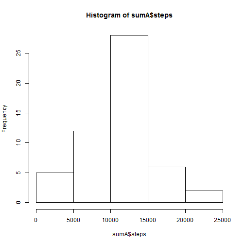
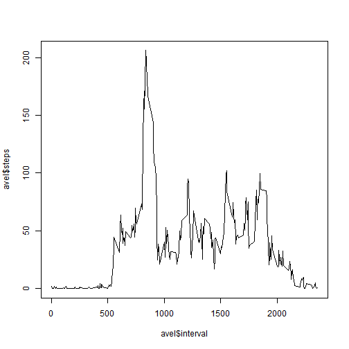
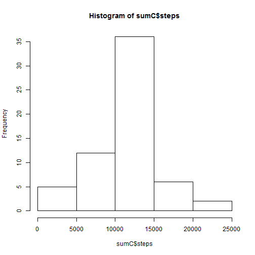

This is my document for the Peer Assessment 1. I address the questions below with code examples.

## Loading and preprocessing the data
I set the directory and read in the source file.


```r
setwd("./ReproducibleResearchAssignment1")
```

```
## Error in setwd("./ReproducibleResearchAssignment1"): cannot change working directory
```

```r
## Read in activity data
activity <- read.cs
```

```
## Error in eval(expr, envir, enclos): object 'read.cs' not found
```

```r
## I aggregate the data to calculate the sums for the steps.
sumA <- aggregate(steps ~ date ,data = activity, sum)
```
## What is mean total number of steps taken per day?
1. I draw the histogram for the total steps.

```r
hist(sumA$steps)
```

 

```r
dev.copy(png, file= "histogramTotalStepsIgnoredNAs.png")
```

```
## png 
##   5
```

```r
dev.off()
```

 

```
## RStudioGD 
##         2
```
2. The mean and median are calculated with the code below:

```r
meanA <- mean(sumA$steps)
medianA <- median(sumA$steps)
```
They are: mean: 10766.19 and median: 10765

## What is the average daily activity pattern?
1. the code for the time series plot is below. Again, I aggregated the steps this time with intervals and the function, mean.

```r
aveI <- aggregate(steps ~ interval ,data = activity, mean)
plot(aveI$interval,aveI$steps, type = "l")
```

 

```r
dev.copy(png, file= "averageStepsPerInterval.png")
```

```
## png 
##   5
```

```r
dev.off()
```

 

```
## RStudioGD 
##         2
```
2. The plot shows the interval with the maximum average steps. The code below is the calculation.

```r
xI <- aveI$interval[which.max(aveI$steps)]
```

The interval is 835.

## Inputing missing values
1. To calculate the number of missing values I subtracted the number of complete cases from the total number of step entries, rows, The code is below. 

```r
naT <- length(activity$steps) - sum(complete.cases(activity$steps))
```
There were 2304 missing step counts.

2. The strategy I used to fill in the missing data was to use the means of each interval. The code is:

```r
aveS <- aveI$steps
actS <- activity
```
3. The new dataset was created by replacing the NA steps with the average values as shown in the code below.

```r
actS$steps[is.na(actS$steps)] <- aveS
```
4. The resulting histogram was created by the code below.

```r
sumC <- aggregate(steps ~ date ,data = actS, sum)
hist(sumC$steps)
```

 

```r
dev.copy(png, file= "histogramTotalStepsFilledNAs.png")
```

```
## png 
##   5
```

```r
dev.off()
```

 

```
## RStudioGD 
##         2
```
The mean and median are calculated by the code below.

```r
meanC <- mean(sumC$steps)
medianC <- median(sumC$steps)
```
They are virtually the same as the values with the NAs ignored. 
They are: mean: 10766.19 and median: 10766.19. I tested other missing value replacements and got differences. It was using a good choice that kept them close. They was not impact when using good replacement choices.

## Are there differences in activity patterns between weekdays and weekends?
1. The new weekday/weekend factor and dataframe are shown in the code below.

```r
dateAsDate <- as.Date(activity$date, format = "%Y-%m-%d")
daylist <- weekdays(dateAsDate,abbreviate = TRUE)
daylist[daylist %in% c("Sat","Sun")] <- "weekend"
daylist[daylist != "weekend"] <- "weekday"
activeWeek <- cbind(actS,daylist)
```
2. The code to create the average steps is below.

```r
stepsAveInt <- aggregate(activeWeek, by=list(activeWeek$interval,activeWeek$daylist),FUN="mean")
```

```
## Warning in mean.default(X[[1L]], ...): argument is not numeric or logical:
## returning NA
```

```
## Warning in mean.default(X[[2L]], ...): argument is not numeric or logical:
## returning NA
```

```
## Warning in mean.default(X[[3L]], ...): argument is not numeric or logical:
## returning NA
```

```
## Warning in mean.default(X[[4L]], ...): argument is not numeric or logical:
## returning NA
```

```
## Warning in mean.default(X[[5L]], ...): argument is not numeric or logical:
## returning NA
```

```
## Warning in mean.default(X[[6L]], ...): argument is not numeric or logical:
## returning NA
```

```
## Warning in mean.default(X[[7L]], ...): argument is not numeric or logical:
## returning NA
```

```
## Warning in mean.default(X[[8L]], ...): argument is not numeric or logical:
## returning NA
```

```
## Warning in mean.default(X[[9L]], ...): argument is not numeric or logical:
## returning NA
```

```
## Warning in mean.default(X[[10L]], ...): argument is not numeric or
## logical: returning NA
```

```
## Warning in mean.default(X[[11L]], ...): argument is not numeric or
## logical: returning NA
```

```
## Warning in mean.default(X[[12L]], ...): argument is not numeric or
## logical: returning NA
```

```
## Warning in mean.default(X[[13L]], ...): argument is not numeric or
## logical: returning NA
```

```
## Warning in mean.default(X[[14L]], ...): argument is not numeric or
## logical: returning NA
```

```
## Warning in mean.default(X[[15L]], ...): argument is not numeric or
## logical: returning NA
```

```
## Warning in mean.default(X[[16L]], ...): argument is not numeric or
## logical: returning NA
```

```
## Warning in mean.default(X[[17L]], ...): argument is not numeric or
## logical: returning NA
```

```
## Warning in mean.default(X[[18L]], ...): argument is not numeric or
## logical: returning NA
```

```
## Warning in mean.default(X[[19L]], ...): argument is not numeric or
## logical: returning NA
```

```
## Warning in mean.default(X[[20L]], ...): argument is not numeric or
## logical: returning NA
```

```
## Warning in mean.default(X[[21L]], ...): argument is not numeric or
## logical: returning NA
```

```
## Warning in mean.default(X[[22L]], ...): argument is not numeric or
## logical: returning NA
```

```
## Warning in mean.default(X[[23L]], ...): argument is not numeric or
## logical: returning NA
```

```
## Warning in mean.default(X[[24L]], ...): argument is not numeric or
## logical: returning NA
```

```
## Warning in mean.default(X[[25L]], ...): argument is not numeric or
## logical: returning NA
```

```
## Warning in mean.default(X[[26L]], ...): argument is not numeric or
## logical: returning NA
```

```
## Warning in mean.default(X[[27L]], ...): argument is not numeric or
## logical: returning NA
```

```
## Warning in mean.default(X[[28L]], ...): argument is not numeric or
## logical: returning NA
```

```
## Warning in mean.default(X[[29L]], ...): argument is not numeric or
## logical: returning NA
```

```
## Warning in mean.default(X[[30L]], ...): argument is not numeric or
## logical: returning NA
```

```
## Warning in mean.default(X[[31L]], ...): argument is not numeric or
## logical: returning NA
```

```
## Warning in mean.default(X[[32L]], ...): argument is not numeric or
## logical: returning NA
```

```
## Warning in mean.default(X[[33L]], ...): argument is not numeric or
## logical: returning NA
```

```
## Warning in mean.default(X[[34L]], ...): argument is not numeric or
## logical: returning NA
```

```
## Warning in mean.default(X[[35L]], ...): argument is not numeric or
## logical: returning NA
```

```
## Warning in mean.default(X[[36L]], ...): argument is not numeric or
## logical: returning NA
```

```
## Warning in mean.default(X[[37L]], ...): argument is not numeric or
## logical: returning NA
```

```
## Warning in mean.default(X[[38L]], ...): argument is not numeric or
## logical: returning NA
```

```
## Warning in mean.default(X[[39L]], ...): argument is not numeric or
## logical: returning NA
```

```
## Warning in mean.default(X[[40L]], ...): argument is not numeric or
## logical: returning NA
```

```
## Warning in mean.default(X[[41L]], ...): argument is not numeric or
## logical: returning NA
```

```
## Warning in mean.default(X[[42L]], ...): argument is not numeric or
## logical: returning NA
```

```
## Warning in mean.default(X[[43L]], ...): argument is not numeric or
## logical: returning NA
```

```
## Warning in mean.default(X[[44L]], ...): argument is not numeric or
## logical: returning NA
```

```
## Warning in mean.default(X[[45L]], ...): argument is not numeric or
## logical: returning NA
```

```
## Warning in mean.default(X[[46L]], ...): argument is not numeric or
## logical: returning NA
```

```
## Warning in mean.default(X[[47L]], ...): argument is not numeric or
## logical: returning NA
```

```
## Warning in mean.default(X[[48L]], ...): argument is not numeric or
## logical: returning NA
```

```
## Warning in mean.default(X[[49L]], ...): argument is not numeric or
## logical: returning NA
```

```
## Warning in mean.default(X[[50L]], ...): argument is not numeric or
## logical: returning NA
```

```
## Warning in mean.default(X[[51L]], ...): argument is not numeric or
## logical: returning NA
```

```
## Warning in mean.default(X[[52L]], ...): argument is not numeric or
## logical: returning NA
```

```
## Warning in mean.default(X[[53L]], ...): argument is not numeric or
## logical: returning NA
```

```
## Warning in mean.default(X[[54L]], ...): argument is not numeric or
## logical: returning NA
```

```
## Warning in mean.default(X[[55L]], ...): argument is not numeric or
## logical: returning NA
```

```
## Warning in mean.default(X[[56L]], ...): argument is not numeric or
## logical: returning NA
```

```
## Warning in mean.default(X[[57L]], ...): argument is not numeric or
## logical: returning NA
```

```
## Warning in mean.default(X[[58L]], ...): argument is not numeric or
## logical: returning NA
```

```
## Warning in mean.default(X[[59L]], ...): argument is not numeric or
## logical: returning NA
```

```
## Warning in mean.default(X[[60L]], ...): argument is not numeric or
## logical: returning NA
```

```
## Warning in mean.default(X[[61L]], ...): argument is not numeric or
## logical: returning NA
```

```
## Warning in mean.default(X[[62L]], ...): argument is not numeric or
## logical: returning NA
```

```
## Warning in mean.default(X[[63L]], ...): argument is not numeric or
## logical: returning NA
```

```
## Warning in mean.default(X[[64L]], ...): argument is not numeric or
## logical: returning NA
```

```
## Warning in mean.default(X[[65L]], ...): argument is not numeric or
## logical: returning NA
```

```
## Warning in mean.default(X[[66L]], ...): argument is not numeric or
## logical: returning NA
```

```
## Warning in mean.default(X[[67L]], ...): argument is not numeric or
## logical: returning NA
```

```
## Warning in mean.default(X[[68L]], ...): argument is not numeric or
## logical: returning NA
```

```
## Warning in mean.default(X[[69L]], ...): argument is not numeric or
## logical: returning NA
```

```
## Warning in mean.default(X[[70L]], ...): argument is not numeric or
## logical: returning NA
```

```
## Warning in mean.default(X[[71L]], ...): argument is not numeric or
## logical: returning NA
```

```
## Warning in mean.default(X[[72L]], ...): argument is not numeric or
## logical: returning NA
```

```
## Warning in mean.default(X[[73L]], ...): argument is not numeric or
## logical: returning NA
```

```
## Warning in mean.default(X[[74L]], ...): argument is not numeric or
## logical: returning NA
```

```
## Warning in mean.default(X[[75L]], ...): argument is not numeric or
## logical: returning NA
```

```
## Warning in mean.default(X[[76L]], ...): argument is not numeric or
## logical: returning NA
```

```
## Warning in mean.default(X[[77L]], ...): argument is not numeric or
## logical: returning NA
```

```
## Warning in mean.default(X[[78L]], ...): argument is not numeric or
## logical: returning NA
```

```
## Warning in mean.default(X[[79L]], ...): argument is not numeric or
## logical: returning NA
```

```
## Warning in mean.default(X[[80L]], ...): argument is not numeric or
## logical: returning NA
```

```
## Warning in mean.default(X[[81L]], ...): argument is not numeric or
## logical: returning NA
```

```
## Warning in mean.default(X[[82L]], ...): argument is not numeric or
## logical: returning NA
```

```
## Warning in mean.default(X[[83L]], ...): argument is not numeric or
## logical: returning NA
```

```
## Warning in mean.default(X[[84L]], ...): argument is not numeric or
## logical: returning NA
```

```
## Warning in mean.default(X[[85L]], ...): argument is not numeric or
## logical: returning NA
```

```
## Warning in mean.default(X[[86L]], ...): argument is not numeric or
## logical: returning NA
```

```
## Warning in mean.default(X[[87L]], ...): argument is not numeric or
## logical: returning NA
```

```
## Warning in mean.default(X[[88L]], ...): argument is not numeric or
## logical: returning NA
```

```
## Warning in mean.default(X[[89L]], ...): argument is not numeric or
## logical: returning NA
```

```
## Warning in mean.default(X[[90L]], ...): argument is not numeric or
## logical: returning NA
```

```
## Warning in mean.default(X[[91L]], ...): argument is not numeric or
## logical: returning NA
```

```
## Warning in mean.default(X[[92L]], ...): argument is not numeric or
## logical: returning NA
```

```
## Warning in mean.default(X[[93L]], ...): argument is not numeric or
## logical: returning NA
```

```
## Warning in mean.default(X[[94L]], ...): argument is not numeric or
## logical: returning NA
```

```
## Warning in mean.default(X[[95L]], ...): argument is not numeric or
## logical: returning NA
```

```
## Warning in mean.default(X[[96L]], ...): argument is not numeric or
## logical: returning NA
```

```
## Warning in mean.default(X[[97L]], ...): argument is not numeric or
## logical: returning NA
```

```
## Warning in mean.default(X[[98L]], ...): argument is not numeric or
## logical: returning NA
```

```
## Warning in mean.default(X[[99L]], ...): argument is not numeric or
## logical: returning NA
```

```
## Warning in mean.default(X[[100L]], ...): argument is not numeric or
## logical: returning NA
```

```
## Warning in mean.default(X[[101L]], ...): argument is not numeric or
## logical: returning NA
```

```
## Warning in mean.default(X[[102L]], ...): argument is not numeric or
## logical: returning NA
```

```
## Warning in mean.default(X[[103L]], ...): argument is not numeric or
## logical: returning NA
```

```
## Warning in mean.default(X[[104L]], ...): argument is not numeric or
## logical: returning NA
```

```
## Warning in mean.default(X[[105L]], ...): argument is not numeric or
## logical: returning NA
```

```
## Warning in mean.default(X[[106L]], ...): argument is not numeric or
## logical: returning NA
```

```
## Warning in mean.default(X[[107L]], ...): argument is not numeric or
## logical: returning NA
```

```
## Warning in mean.default(X[[108L]], ...): argument is not numeric or
## logical: returning NA
```

```
## Warning in mean.default(X[[109L]], ...): argument is not numeric or
## logical: returning NA
```

```
## Warning in mean.default(X[[110L]], ...): argument is not numeric or
## logical: returning NA
```

```
## Warning in mean.default(X[[111L]], ...): argument is not numeric or
## logical: returning NA
```

```
## Warning in mean.default(X[[112L]], ...): argument is not numeric or
## logical: returning NA
```

```
## Warning in mean.default(X[[113L]], ...): argument is not numeric or
## logical: returning NA
```

```
## Warning in mean.default(X[[114L]], ...): argument is not numeric or
## logical: returning NA
```

```
## Warning in mean.default(X[[115L]], ...): argument is not numeric or
## logical: returning NA
```

```
## Warning in mean.default(X[[116L]], ...): argument is not numeric or
## logical: returning NA
```

```
## Warning in mean.default(X[[117L]], ...): argument is not numeric or
## logical: returning NA
```

```
## Warning in mean.default(X[[118L]], ...): argument is not numeric or
## logical: returning NA
```

```
## Warning in mean.default(X[[119L]], ...): argument is not numeric or
## logical: returning NA
```

```
## Warning in mean.default(X[[120L]], ...): argument is not numeric or
## logical: returning NA
```

```
## Warning in mean.default(X[[121L]], ...): argument is not numeric or
## logical: returning NA
```

```
## Warning in mean.default(X[[122L]], ...): argument is not numeric or
## logical: returning NA
```

```
## Warning in mean.default(X[[123L]], ...): argument is not numeric or
## logical: returning NA
```

```
## Warning in mean.default(X[[124L]], ...): argument is not numeric or
## logical: returning NA
```

```
## Warning in mean.default(X[[125L]], ...): argument is not numeric or
## logical: returning NA
```

```
## Warning in mean.default(X[[126L]], ...): argument is not numeric or
## logical: returning NA
```

```
## Warning in mean.default(X[[127L]], ...): argument is not numeric or
## logical: returning NA
```

```
## Warning in mean.default(X[[128L]], ...): argument is not numeric or
## logical: returning NA
```

```
## Warning in mean.default(X[[129L]], ...): argument is not numeric or
## logical: returning NA
```

```
## Warning in mean.default(X[[130L]], ...): argument is not numeric or
## logical: returning NA
```

```
## Warning in mean.default(X[[131L]], ...): argument is not numeric or
## logical: returning NA
```

```
## Warning in mean.default(X[[132L]], ...): argument is not numeric or
## logical: returning NA
```

```
## Warning in mean.default(X[[133L]], ...): argument is not numeric or
## logical: returning NA
```

```
## Warning in mean.default(X[[134L]], ...): argument is not numeric or
## logical: returning NA
```

```
## Warning in mean.default(X[[135L]], ...): argument is not numeric or
## logical: returning NA
```

```
## Warning in mean.default(X[[136L]], ...): argument is not numeric or
## logical: returning NA
```

```
## Warning in mean.default(X[[137L]], ...): argument is not numeric or
## logical: returning NA
```

```
## Warning in mean.default(X[[138L]], ...): argument is not numeric or
## logical: returning NA
```

```
## Warning in mean.default(X[[139L]], ...): argument is not numeric or
## logical: returning NA
```

```
## Warning in mean.default(X[[140L]], ...): argument is not numeric or
## logical: returning NA
```

```
## Warning in mean.default(X[[141L]], ...): argument is not numeric or
## logical: returning NA
```

```
## Warning in mean.default(X[[142L]], ...): argument is not numeric or
## logical: returning NA
```

```
## Warning in mean.default(X[[143L]], ...): argument is not numeric or
## logical: returning NA
```

```
## Warning in mean.default(X[[144L]], ...): argument is not numeric or
## logical: returning NA
```

```
## Warning in mean.default(X[[145L]], ...): argument is not numeric or
## logical: returning NA
```

```
## Warning in mean.default(X[[146L]], ...): argument is not numeric or
## logical: returning NA
```

```
## Warning in mean.default(X[[147L]], ...): argument is not numeric or
## logical: returning NA
```

```
## Warning in mean.default(X[[148L]], ...): argument is not numeric or
## logical: returning NA
```

```
## Warning in mean.default(X[[149L]], ...): argument is not numeric or
## logical: returning NA
```

```
## Warning in mean.default(X[[150L]], ...): argument is not numeric or
## logical: returning NA
```

```
## Warning in mean.default(X[[151L]], ...): argument is not numeric or
## logical: returning NA
```

```
## Warning in mean.default(X[[152L]], ...): argument is not numeric or
## logical: returning NA
```

```
## Warning in mean.default(X[[153L]], ...): argument is not numeric or
## logical: returning NA
```

```
## Warning in mean.default(X[[154L]], ...): argument is not numeric or
## logical: returning NA
```

```
## Warning in mean.default(X[[155L]], ...): argument is not numeric or
## logical: returning NA
```

```
## Warning in mean.default(X[[156L]], ...): argument is not numeric or
## logical: returning NA
```

```
## Warning in mean.default(X[[157L]], ...): argument is not numeric or
## logical: returning NA
```

```
## Warning in mean.default(X[[158L]], ...): argument is not numeric or
## logical: returning NA
```

```
## Warning in mean.default(X[[159L]], ...): argument is not numeric or
## logical: returning NA
```

```
## Warning in mean.default(X[[160L]], ...): argument is not numeric or
## logical: returning NA
```

```
## Warning in mean.default(X[[161L]], ...): argument is not numeric or
## logical: returning NA
```

```
## Warning in mean.default(X[[162L]], ...): argument is not numeric or
## logical: returning NA
```

```
## Warning in mean.default(X[[163L]], ...): argument is not numeric or
## logical: returning NA
```

```
## Warning in mean.default(X[[164L]], ...): argument is not numeric or
## logical: returning NA
```

```
## Warning in mean.default(X[[165L]], ...): argument is not numeric or
## logical: returning NA
```

```
## Warning in mean.default(X[[166L]], ...): argument is not numeric or
## logical: returning NA
```

```
## Warning in mean.default(X[[167L]], ...): argument is not numeric or
## logical: returning NA
```

```
## Warning in mean.default(X[[168L]], ...): argument is not numeric or
## logical: returning NA
```

```
## Warning in mean.default(X[[169L]], ...): argument is not numeric or
## logical: returning NA
```

```
## Warning in mean.default(X[[170L]], ...): argument is not numeric or
## logical: returning NA
```

```
## Warning in mean.default(X[[171L]], ...): argument is not numeric or
## logical: returning NA
```

```
## Warning in mean.default(X[[172L]], ...): argument is not numeric or
## logical: returning NA
```

```
## Warning in mean.default(X[[173L]], ...): argument is not numeric or
## logical: returning NA
```

```
## Warning in mean.default(X[[174L]], ...): argument is not numeric or
## logical: returning NA
```

```
## Warning in mean.default(X[[175L]], ...): argument is not numeric or
## logical: returning NA
```

```
## Warning in mean.default(X[[176L]], ...): argument is not numeric or
## logical: returning NA
```

```
## Warning in mean.default(X[[177L]], ...): argument is not numeric or
## logical: returning NA
```

```
## Warning in mean.default(X[[178L]], ...): argument is not numeric or
## logical: returning NA
```

```
## Warning in mean.default(X[[179L]], ...): argument is not numeric or
## logical: returning NA
```

```
## Warning in mean.default(X[[180L]], ...): argument is not numeric or
## logical: returning NA
```

```
## Warning in mean.default(X[[181L]], ...): argument is not numeric or
## logical: returning NA
```

```
## Warning in mean.default(X[[182L]], ...): argument is not numeric or
## logical: returning NA
```

```
## Warning in mean.default(X[[183L]], ...): argument is not numeric or
## logical: returning NA
```

```
## Warning in mean.default(X[[184L]], ...): argument is not numeric or
## logical: returning NA
```

```
## Warning in mean.default(X[[185L]], ...): argument is not numeric or
## logical: returning NA
```

```
## Warning in mean.default(X[[186L]], ...): argument is not numeric or
## logical: returning NA
```

```
## Warning in mean.default(X[[187L]], ...): argument is not numeric or
## logical: returning NA
```

```
## Warning in mean.default(X[[188L]], ...): argument is not numeric or
## logical: returning NA
```

```
## Warning in mean.default(X[[189L]], ...): argument is not numeric or
## logical: returning NA
```

```
## Warning in mean.default(X[[190L]], ...): argument is not numeric or
## logical: returning NA
```

```
## Warning in mean.default(X[[191L]], ...): argument is not numeric or
## logical: returning NA
```

```
## Warning in mean.default(X[[192L]], ...): argument is not numeric or
## logical: returning NA
```

```
## Warning in mean.default(X[[193L]], ...): argument is not numeric or
## logical: returning NA
```

```
## Warning in mean.default(X[[194L]], ...): argument is not numeric or
## logical: returning NA
```

```
## Warning in mean.default(X[[195L]], ...): argument is not numeric or
## logical: returning NA
```

```
## Warning in mean.default(X[[196L]], ...): argument is not numeric or
## logical: returning NA
```

```
## Warning in mean.default(X[[197L]], ...): argument is not numeric or
## logical: returning NA
```

```
## Warning in mean.default(X[[198L]], ...): argument is not numeric or
## logical: returning NA
```

```
## Warning in mean.default(X[[199L]], ...): argument is not numeric or
## logical: returning NA
```

```
## Warning in mean.default(X[[200L]], ...): argument is not numeric or
## logical: returning NA
```

```
## Warning in mean.default(X[[201L]], ...): argument is not numeric or
## logical: returning NA
```

```
## Warning in mean.default(X[[202L]], ...): argument is not numeric or
## logical: returning NA
```

```
## Warning in mean.default(X[[203L]], ...): argument is not numeric or
## logical: returning NA
```

```
## Warning in mean.default(X[[204L]], ...): argument is not numeric or
## logical: returning NA
```

```
## Warning in mean.default(X[[205L]], ...): argument is not numeric or
## logical: returning NA
```

```
## Warning in mean.default(X[[206L]], ...): argument is not numeric or
## logical: returning NA
```

```
## Warning in mean.default(X[[207L]], ...): argument is not numeric or
## logical: returning NA
```

```
## Warning in mean.default(X[[208L]], ...): argument is not numeric or
## logical: returning NA
```

```
## Warning in mean.default(X[[209L]], ...): argument is not numeric or
## logical: returning NA
```

```
## Warning in mean.default(X[[210L]], ...): argument is not numeric or
## logical: returning NA
```

```
## Warning in mean.default(X[[211L]], ...): argument is not numeric or
## logical: returning NA
```

```
## Warning in mean.default(X[[212L]], ...): argument is not numeric or
## logical: returning NA
```

```
## Warning in mean.default(X[[213L]], ...): argument is not numeric or
## logical: returning NA
```

```
## Warning in mean.default(X[[214L]], ...): argument is not numeric or
## logical: returning NA
```

```
## Warning in mean.default(X[[215L]], ...): argument is not numeric or
## logical: returning NA
```

```
## Warning in mean.default(X[[216L]], ...): argument is not numeric or
## logical: returning NA
```

```
## Warning in mean.default(X[[217L]], ...): argument is not numeric or
## logical: returning NA
```

```
## Warning in mean.default(X[[218L]], ...): argument is not numeric or
## logical: returning NA
```

```
## Warning in mean.default(X[[219L]], ...): argument is not numeric or
## logical: returning NA
```

```
## Warning in mean.default(X[[220L]], ...): argument is not numeric or
## logical: returning NA
```

```
## Warning in mean.default(X[[221L]], ...): argument is not numeric or
## logical: returning NA
```

```
## Warning in mean.default(X[[222L]], ...): argument is not numeric or
## logical: returning NA
```

```
## Warning in mean.default(X[[223L]], ...): argument is not numeric or
## logical: returning NA
```

```
## Warning in mean.default(X[[224L]], ...): argument is not numeric or
## logical: returning NA
```

```
## Warning in mean.default(X[[225L]], ...): argument is not numeric or
## logical: returning NA
```

```
## Warning in mean.default(X[[226L]], ...): argument is not numeric or
## logical: returning NA
```

```
## Warning in mean.default(X[[227L]], ...): argument is not numeric or
## logical: returning NA
```

```
## Warning in mean.default(X[[228L]], ...): argument is not numeric or
## logical: returning NA
```

```
## Warning in mean.default(X[[229L]], ...): argument is not numeric or
## logical: returning NA
```

```
## Warning in mean.default(X[[230L]], ...): argument is not numeric or
## logical: returning NA
```

```
## Warning in mean.default(X[[231L]], ...): argument is not numeric or
## logical: returning NA
```

```
## Warning in mean.default(X[[232L]], ...): argument is not numeric or
## logical: returning NA
```

```
## Warning in mean.default(X[[233L]], ...): argument is not numeric or
## logical: returning NA
```

```
## Warning in mean.default(X[[234L]], ...): argument is not numeric or
## logical: returning NA
```

```
## Warning in mean.default(X[[235L]], ...): argument is not numeric or
## logical: returning NA
```

```
## Warning in mean.default(X[[236L]], ...): argument is not numeric or
## logical: returning NA
```

```
## Warning in mean.default(X[[237L]], ...): argument is not numeric or
## logical: returning NA
```

```
## Warning in mean.default(X[[238L]], ...): argument is not numeric or
## logical: returning NA
```

```
## Warning in mean.default(X[[239L]], ...): argument is not numeric or
## logical: returning NA
```

```
## Warning in mean.default(X[[240L]], ...): argument is not numeric or
## logical: returning NA
```

```
## Warning in mean.default(X[[241L]], ...): argument is not numeric or
## logical: returning NA
```

```
## Warning in mean.default(X[[242L]], ...): argument is not numeric or
## logical: returning NA
```

```
## Warning in mean.default(X[[243L]], ...): argument is not numeric or
## logical: returning NA
```

```
## Warning in mean.default(X[[244L]], ...): argument is not numeric or
## logical: returning NA
```

```
## Warning in mean.default(X[[245L]], ...): argument is not numeric or
## logical: returning NA
```

```
## Warning in mean.default(X[[246L]], ...): argument is not numeric or
## logical: returning NA
```

```
## Warning in mean.default(X[[247L]], ...): argument is not numeric or
## logical: returning NA
```

```
## Warning in mean.default(X[[248L]], ...): argument is not numeric or
## logical: returning NA
```

```
## Warning in mean.default(X[[249L]], ...): argument is not numeric or
## logical: returning NA
```

```
## Warning in mean.default(X[[250L]], ...): argument is not numeric or
## logical: returning NA
```

```
## Warning in mean.default(X[[251L]], ...): argument is not numeric or
## logical: returning NA
```

```
## Warning in mean.default(X[[252L]], ...): argument is not numeric or
## logical: returning NA
```

```
## Warning in mean.default(X[[253L]], ...): argument is not numeric or
## logical: returning NA
```

```
## Warning in mean.default(X[[254L]], ...): argument is not numeric or
## logical: returning NA
```

```
## Warning in mean.default(X[[255L]], ...): argument is not numeric or
## logical: returning NA
```

```
## Warning in mean.default(X[[256L]], ...): argument is not numeric or
## logical: returning NA
```

```
## Warning in mean.default(X[[257L]], ...): argument is not numeric or
## logical: returning NA
```

```
## Warning in mean.default(X[[258L]], ...): argument is not numeric or
## logical: returning NA
```

```
## Warning in mean.default(X[[259L]], ...): argument is not numeric or
## logical: returning NA
```

```
## Warning in mean.default(X[[260L]], ...): argument is not numeric or
## logical: returning NA
```

```
## Warning in mean.default(X[[261L]], ...): argument is not numeric or
## logical: returning NA
```

```
## Warning in mean.default(X[[262L]], ...): argument is not numeric or
## logical: returning NA
```

```
## Warning in mean.default(X[[263L]], ...): argument is not numeric or
## logical: returning NA
```

```
## Warning in mean.default(X[[264L]], ...): argument is not numeric or
## logical: returning NA
```

```
## Warning in mean.default(X[[265L]], ...): argument is not numeric or
## logical: returning NA
```

```
## Warning in mean.default(X[[266L]], ...): argument is not numeric or
## logical: returning NA
```

```
## Warning in mean.default(X[[267L]], ...): argument is not numeric or
## logical: returning NA
```

```
## Warning in mean.default(X[[268L]], ...): argument is not numeric or
## logical: returning NA
```

```
## Warning in mean.default(X[[269L]], ...): argument is not numeric or
## logical: returning NA
```

```
## Warning in mean.default(X[[270L]], ...): argument is not numeric or
## logical: returning NA
```

```
## Warning in mean.default(X[[271L]], ...): argument is not numeric or
## logical: returning NA
```

```
## Warning in mean.default(X[[272L]], ...): argument is not numeric or
## logical: returning NA
```

```
## Warning in mean.default(X[[273L]], ...): argument is not numeric or
## logical: returning NA
```

```
## Warning in mean.default(X[[274L]], ...): argument is not numeric or
## logical: returning NA
```

```
## Warning in mean.default(X[[275L]], ...): argument is not numeric or
## logical: returning NA
```

```
## Warning in mean.default(X[[276L]], ...): argument is not numeric or
## logical: returning NA
```

```
## Warning in mean.default(X[[277L]], ...): argument is not numeric or
## logical: returning NA
```

```
## Warning in mean.default(X[[278L]], ...): argument is not numeric or
## logical: returning NA
```

```
## Warning in mean.default(X[[279L]], ...): argument is not numeric or
## logical: returning NA
```

```
## Warning in mean.default(X[[280L]], ...): argument is not numeric or
## logical: returning NA
```

```
## Warning in mean.default(X[[281L]], ...): argument is not numeric or
## logical: returning NA
```

```
## Warning in mean.default(X[[282L]], ...): argument is not numeric or
## logical: returning NA
```

```
## Warning in mean.default(X[[283L]], ...): argument is not numeric or
## logical: returning NA
```

```
## Warning in mean.default(X[[284L]], ...): argument is not numeric or
## logical: returning NA
```

```
## Warning in mean.default(X[[285L]], ...): argument is not numeric or
## logical: returning NA
```

```
## Warning in mean.default(X[[286L]], ...): argument is not numeric or
## logical: returning NA
```

```
## Warning in mean.default(X[[287L]], ...): argument is not numeric or
## logical: returning NA
```

```
## Warning in mean.default(X[[288L]], ...): argument is not numeric or
## logical: returning NA
```

```
## Warning in mean.default(X[[289L]], ...): argument is not numeric or
## logical: returning NA
```

```
## Warning in mean.default(X[[290L]], ...): argument is not numeric or
## logical: returning NA
```

```
## Warning in mean.default(X[[291L]], ...): argument is not numeric or
## logical: returning NA
```

```
## Warning in mean.default(X[[292L]], ...): argument is not numeric or
## logical: returning NA
```

```
## Warning in mean.default(X[[293L]], ...): argument is not numeric or
## logical: returning NA
```

```
## Warning in mean.default(X[[294L]], ...): argument is not numeric or
## logical: returning NA
```

```
## Warning in mean.default(X[[295L]], ...): argument is not numeric or
## logical: returning NA
```

```
## Warning in mean.default(X[[296L]], ...): argument is not numeric or
## logical: returning NA
```

```
## Warning in mean.default(X[[297L]], ...): argument is not numeric or
## logical: returning NA
```

```
## Warning in mean.default(X[[298L]], ...): argument is not numeric or
## logical: returning NA
```

```
## Warning in mean.default(X[[299L]], ...): argument is not numeric or
## logical: returning NA
```

```
## Warning in mean.default(X[[300L]], ...): argument is not numeric or
## logical: returning NA
```

```
## Warning in mean.default(X[[301L]], ...): argument is not numeric or
## logical: returning NA
```

```
## Warning in mean.default(X[[302L]], ...): argument is not numeric or
## logical: returning NA
```

```
## Warning in mean.default(X[[303L]], ...): argument is not numeric or
## logical: returning NA
```

```
## Warning in mean.default(X[[304L]], ...): argument is not numeric or
## logical: returning NA
```

```
## Warning in mean.default(X[[305L]], ...): argument is not numeric or
## logical: returning NA
```

```
## Warning in mean.default(X[[306L]], ...): argument is not numeric or
## logical: returning NA
```

```
## Warning in mean.default(X[[307L]], ...): argument is not numeric or
## logical: returning NA
```

```
## Warning in mean.default(X[[308L]], ...): argument is not numeric or
## logical: returning NA
```

```
## Warning in mean.default(X[[309L]], ...): argument is not numeric or
## logical: returning NA
```

```
## Warning in mean.default(X[[310L]], ...): argument is not numeric or
## logical: returning NA
```

```
## Warning in mean.default(X[[311L]], ...): argument is not numeric or
## logical: returning NA
```

```
## Warning in mean.default(X[[312L]], ...): argument is not numeric or
## logical: returning NA
```

```
## Warning in mean.default(X[[313L]], ...): argument is not numeric or
## logical: returning NA
```

```
## Warning in mean.default(X[[314L]], ...): argument is not numeric or
## logical: returning NA
```

```
## Warning in mean.default(X[[315L]], ...): argument is not numeric or
## logical: returning NA
```

```
## Warning in mean.default(X[[316L]], ...): argument is not numeric or
## logical: returning NA
```

```
## Warning in mean.default(X[[317L]], ...): argument is not numeric or
## logical: returning NA
```

```
## Warning in mean.default(X[[318L]], ...): argument is not numeric or
## logical: returning NA
```

```
## Warning in mean.default(X[[319L]], ...): argument is not numeric or
## logical: returning NA
```

```
## Warning in mean.default(X[[320L]], ...): argument is not numeric or
## logical: returning NA
```

```
## Warning in mean.default(X[[321L]], ...): argument is not numeric or
## logical: returning NA
```

```
## Warning in mean.default(X[[322L]], ...): argument is not numeric or
## logical: returning NA
```

```
## Warning in mean.default(X[[323L]], ...): argument is not numeric or
## logical: returning NA
```

```
## Warning in mean.default(X[[324L]], ...): argument is not numeric or
## logical: returning NA
```

```
## Warning in mean.default(X[[325L]], ...): argument is not numeric or
## logical: returning NA
```

```
## Warning in mean.default(X[[326L]], ...): argument is not numeric or
## logical: returning NA
```

```
## Warning in mean.default(X[[327L]], ...): argument is not numeric or
## logical: returning NA
```

```
## Warning in mean.default(X[[328L]], ...): argument is not numeric or
## logical: returning NA
```

```
## Warning in mean.default(X[[329L]], ...): argument is not numeric or
## logical: returning NA
```

```
## Warning in mean.default(X[[330L]], ...): argument is not numeric or
## logical: returning NA
```

```
## Warning in mean.default(X[[331L]], ...): argument is not numeric or
## logical: returning NA
```

```
## Warning in mean.default(X[[332L]], ...): argument is not numeric or
## logical: returning NA
```

```
## Warning in mean.default(X[[333L]], ...): argument is not numeric or
## logical: returning NA
```

```
## Warning in mean.default(X[[334L]], ...): argument is not numeric or
## logical: returning NA
```

```
## Warning in mean.default(X[[335L]], ...): argument is not numeric or
## logical: returning NA
```

```
## Warning in mean.default(X[[336L]], ...): argument is not numeric or
## logical: returning NA
```

```
## Warning in mean.default(X[[337L]], ...): argument is not numeric or
## logical: returning NA
```

```
## Warning in mean.default(X[[338L]], ...): argument is not numeric or
## logical: returning NA
```

```
## Warning in mean.default(X[[339L]], ...): argument is not numeric or
## logical: returning NA
```

```
## Warning in mean.default(X[[340L]], ...): argument is not numeric or
## logical: returning NA
```

```
## Warning in mean.default(X[[341L]], ...): argument is not numeric or
## logical: returning NA
```

```
## Warning in mean.default(X[[342L]], ...): argument is not numeric or
## logical: returning NA
```

```
## Warning in mean.default(X[[343L]], ...): argument is not numeric or
## logical: returning NA
```

```
## Warning in mean.default(X[[344L]], ...): argument is not numeric or
## logical: returning NA
```

```
## Warning in mean.default(X[[345L]], ...): argument is not numeric or
## logical: returning NA
```

```
## Warning in mean.default(X[[346L]], ...): argument is not numeric or
## logical: returning NA
```

```
## Warning in mean.default(X[[347L]], ...): argument is not numeric or
## logical: returning NA
```

```
## Warning in mean.default(X[[348L]], ...): argument is not numeric or
## logical: returning NA
```

```
## Warning in mean.default(X[[349L]], ...): argument is not numeric or
## logical: returning NA
```

```
## Warning in mean.default(X[[350L]], ...): argument is not numeric or
## logical: returning NA
```

```
## Warning in mean.default(X[[351L]], ...): argument is not numeric or
## logical: returning NA
```

```
## Warning in mean.default(X[[352L]], ...): argument is not numeric or
## logical: returning NA
```

```
## Warning in mean.default(X[[353L]], ...): argument is not numeric or
## logical: returning NA
```

```
## Warning in mean.default(X[[354L]], ...): argument is not numeric or
## logical: returning NA
```

```
## Warning in mean.default(X[[355L]], ...): argument is not numeric or
## logical: returning NA
```

```
## Warning in mean.default(X[[356L]], ...): argument is not numeric or
## logical: returning NA
```

```
## Warning in mean.default(X[[357L]], ...): argument is not numeric or
## logical: returning NA
```

```
## Warning in mean.default(X[[358L]], ...): argument is not numeric or
## logical: returning NA
```

```
## Warning in mean.default(X[[359L]], ...): argument is not numeric or
## logical: returning NA
```

```
## Warning in mean.default(X[[360L]], ...): argument is not numeric or
## logical: returning NA
```

```
## Warning in mean.default(X[[361L]], ...): argument is not numeric or
## logical: returning NA
```

```
## Warning in mean.default(X[[362L]], ...): argument is not numeric or
## logical: returning NA
```

```
## Warning in mean.default(X[[363L]], ...): argument is not numeric or
## logical: returning NA
```

```
## Warning in mean.default(X[[364L]], ...): argument is not numeric or
## logical: returning NA
```

```
## Warning in mean.default(X[[365L]], ...): argument is not numeric or
## logical: returning NA
```

```
## Warning in mean.default(X[[366L]], ...): argument is not numeric or
## logical: returning NA
```

```
## Warning in mean.default(X[[367L]], ...): argument is not numeric or
## logical: returning NA
```

```
## Warning in mean.default(X[[368L]], ...): argument is not numeric or
## logical: returning NA
```

```
## Warning in mean.default(X[[369L]], ...): argument is not numeric or
## logical: returning NA
```

```
## Warning in mean.default(X[[370L]], ...): argument is not numeric or
## logical: returning NA
```

```
## Warning in mean.default(X[[371L]], ...): argument is not numeric or
## logical: returning NA
```

```
## Warning in mean.default(X[[372L]], ...): argument is not numeric or
## logical: returning NA
```

```
## Warning in mean.default(X[[373L]], ...): argument is not numeric or
## logical: returning NA
```

```
## Warning in mean.default(X[[374L]], ...): argument is not numeric or
## logical: returning NA
```

```
## Warning in mean.default(X[[375L]], ...): argument is not numeric or
## logical: returning NA
```

```
## Warning in mean.default(X[[376L]], ...): argument is not numeric or
## logical: returning NA
```

```
## Warning in mean.default(X[[377L]], ...): argument is not numeric or
## logical: returning NA
```

```
## Warning in mean.default(X[[378L]], ...): argument is not numeric or
## logical: returning NA
```

```
## Warning in mean.default(X[[379L]], ...): argument is not numeric or
## logical: returning NA
```

```
## Warning in mean.default(X[[380L]], ...): argument is not numeric or
## logical: returning NA
```

```
## Warning in mean.default(X[[381L]], ...): argument is not numeric or
## logical: returning NA
```

```
## Warning in mean.default(X[[382L]], ...): argument is not numeric or
## logical: returning NA
```

```
## Warning in mean.default(X[[383L]], ...): argument is not numeric or
## logical: returning NA
```

```
## Warning in mean.default(X[[384L]], ...): argument is not numeric or
## logical: returning NA
```

```
## Warning in mean.default(X[[385L]], ...): argument is not numeric or
## logical: returning NA
```

```
## Warning in mean.default(X[[386L]], ...): argument is not numeric or
## logical: returning NA
```

```
## Warning in mean.default(X[[387L]], ...): argument is not numeric or
## logical: returning NA
```

```
## Warning in mean.default(X[[388L]], ...): argument is not numeric or
## logical: returning NA
```

```
## Warning in mean.default(X[[389L]], ...): argument is not numeric or
## logical: returning NA
```

```
## Warning in mean.default(X[[390L]], ...): argument is not numeric or
## logical: returning NA
```

```
## Warning in mean.default(X[[391L]], ...): argument is not numeric or
## logical: returning NA
```

```
## Warning in mean.default(X[[392L]], ...): argument is not numeric or
## logical: returning NA
```

```
## Warning in mean.default(X[[393L]], ...): argument is not numeric or
## logical: returning NA
```

```
## Warning in mean.default(X[[394L]], ...): argument is not numeric or
## logical: returning NA
```

```
## Warning in mean.default(X[[395L]], ...): argument is not numeric or
## logical: returning NA
```

```
## Warning in mean.default(X[[396L]], ...): argument is not numeric or
## logical: returning NA
```

```
## Warning in mean.default(X[[397L]], ...): argument is not numeric or
## logical: returning NA
```

```
## Warning in mean.default(X[[398L]], ...): argument is not numeric or
## logical: returning NA
```

```
## Warning in mean.default(X[[399L]], ...): argument is not numeric or
## logical: returning NA
```

```
## Warning in mean.default(X[[400L]], ...): argument is not numeric or
## logical: returning NA
```

```
## Warning in mean.default(X[[401L]], ...): argument is not numeric or
## logical: returning NA
```

```
## Warning in mean.default(X[[402L]], ...): argument is not numeric or
## logical: returning NA
```

```
## Warning in mean.default(X[[403L]], ...): argument is not numeric or
## logical: returning NA
```

```
## Warning in mean.default(X[[404L]], ...): argument is not numeric or
## logical: returning NA
```

```
## Warning in mean.default(X[[405L]], ...): argument is not numeric or
## logical: returning NA
```

```
## Warning in mean.default(X[[406L]], ...): argument is not numeric or
## logical: returning NA
```

```
## Warning in mean.default(X[[407L]], ...): argument is not numeric or
## logical: returning NA
```

```
## Warning in mean.default(X[[408L]], ...): argument is not numeric or
## logical: returning NA
```

```
## Warning in mean.default(X[[409L]], ...): argument is not numeric or
## logical: returning NA
```

```
## Warning in mean.default(X[[410L]], ...): argument is not numeric or
## logical: returning NA
```

```
## Warning in mean.default(X[[411L]], ...): argument is not numeric or
## logical: returning NA
```

```
## Warning in mean.default(X[[412L]], ...): argument is not numeric or
## logical: returning NA
```

```
## Warning in mean.default(X[[413L]], ...): argument is not numeric or
## logical: returning NA
```

```
## Warning in mean.default(X[[414L]], ...): argument is not numeric or
## logical: returning NA
```

```
## Warning in mean.default(X[[415L]], ...): argument is not numeric or
## logical: returning NA
```

```
## Warning in mean.default(X[[416L]], ...): argument is not numeric or
## logical: returning NA
```

```
## Warning in mean.default(X[[417L]], ...): argument is not numeric or
## logical: returning NA
```

```
## Warning in mean.default(X[[418L]], ...): argument is not numeric or
## logical: returning NA
```

```
## Warning in mean.default(X[[419L]], ...): argument is not numeric or
## logical: returning NA
```

```
## Warning in mean.default(X[[420L]], ...): argument is not numeric or
## logical: returning NA
```

```
## Warning in mean.default(X[[421L]], ...): argument is not numeric or
## logical: returning NA
```

```
## Warning in mean.default(X[[422L]], ...): argument is not numeric or
## logical: returning NA
```

```
## Warning in mean.default(X[[423L]], ...): argument is not numeric or
## logical: returning NA
```

```
## Warning in mean.default(X[[424L]], ...): argument is not numeric or
## logical: returning NA
```

```
## Warning in mean.default(X[[425L]], ...): argument is not numeric or
## logical: returning NA
```

```
## Warning in mean.default(X[[426L]], ...): argument is not numeric or
## logical: returning NA
```

```
## Warning in mean.default(X[[427L]], ...): argument is not numeric or
## logical: returning NA
```

```
## Warning in mean.default(X[[428L]], ...): argument is not numeric or
## logical: returning NA
```

```
## Warning in mean.default(X[[429L]], ...): argument is not numeric or
## logical: returning NA
```

```
## Warning in mean.default(X[[430L]], ...): argument is not numeric or
## logical: returning NA
```

```
## Warning in mean.default(X[[431L]], ...): argument is not numeric or
## logical: returning NA
```

```
## Warning in mean.default(X[[432L]], ...): argument is not numeric or
## logical: returning NA
```

```
## Warning in mean.default(X[[433L]], ...): argument is not numeric or
## logical: returning NA
```

```
## Warning in mean.default(X[[434L]], ...): argument is not numeric or
## logical: returning NA
```

```
## Warning in mean.default(X[[435L]], ...): argument is not numeric or
## logical: returning NA
```

```
## Warning in mean.default(X[[436L]], ...): argument is not numeric or
## logical: returning NA
```

```
## Warning in mean.default(X[[437L]], ...): argument is not numeric or
## logical: returning NA
```

```
## Warning in mean.default(X[[438L]], ...): argument is not numeric or
## logical: returning NA
```

```
## Warning in mean.default(X[[439L]], ...): argument is not numeric or
## logical: returning NA
```

```
## Warning in mean.default(X[[440L]], ...): argument is not numeric or
## logical: returning NA
```

```
## Warning in mean.default(X[[441L]], ...): argument is not numeric or
## logical: returning NA
```

```
## Warning in mean.default(X[[442L]], ...): argument is not numeric or
## logical: returning NA
```

```
## Warning in mean.default(X[[443L]], ...): argument is not numeric or
## logical: returning NA
```

```
## Warning in mean.default(X[[444L]], ...): argument is not numeric or
## logical: returning NA
```

```
## Warning in mean.default(X[[445L]], ...): argument is not numeric or
## logical: returning NA
```

```
## Warning in mean.default(X[[446L]], ...): argument is not numeric or
## logical: returning NA
```

```
## Warning in mean.default(X[[447L]], ...): argument is not numeric or
## logical: returning NA
```

```
## Warning in mean.default(X[[448L]], ...): argument is not numeric or
## logical: returning NA
```

```
## Warning in mean.default(X[[449L]], ...): argument is not numeric or
## logical: returning NA
```

```
## Warning in mean.default(X[[450L]], ...): argument is not numeric or
## logical: returning NA
```

```
## Warning in mean.default(X[[451L]], ...): argument is not numeric or
## logical: returning NA
```

```
## Warning in mean.default(X[[452L]], ...): argument is not numeric or
## logical: returning NA
```

```
## Warning in mean.default(X[[453L]], ...): argument is not numeric or
## logical: returning NA
```

```
## Warning in mean.default(X[[454L]], ...): argument is not numeric or
## logical: returning NA
```

```
## Warning in mean.default(X[[455L]], ...): argument is not numeric or
## logical: returning NA
```

```
## Warning in mean.default(X[[456L]], ...): argument is not numeric or
## logical: returning NA
```

```
## Warning in mean.default(X[[457L]], ...): argument is not numeric or
## logical: returning NA
```

```
## Warning in mean.default(X[[458L]], ...): argument is not numeric or
## logical: returning NA
```

```
## Warning in mean.default(X[[459L]], ...): argument is not numeric or
## logical: returning NA
```

```
## Warning in mean.default(X[[460L]], ...): argument is not numeric or
## logical: returning NA
```

```
## Warning in mean.default(X[[461L]], ...): argument is not numeric or
## logical: returning NA
```

```
## Warning in mean.default(X[[462L]], ...): argument is not numeric or
## logical: returning NA
```

```
## Warning in mean.default(X[[463L]], ...): argument is not numeric or
## logical: returning NA
```

```
## Warning in mean.default(X[[464L]], ...): argument is not numeric or
## logical: returning NA
```

```
## Warning in mean.default(X[[465L]], ...): argument is not numeric or
## logical: returning NA
```

```
## Warning in mean.default(X[[466L]], ...): argument is not numeric or
## logical: returning NA
```

```
## Warning in mean.default(X[[467L]], ...): argument is not numeric or
## logical: returning NA
```

```
## Warning in mean.default(X[[468L]], ...): argument is not numeric or
## logical: returning NA
```

```
## Warning in mean.default(X[[469L]], ...): argument is not numeric or
## logical: returning NA
```

```
## Warning in mean.default(X[[470L]], ...): argument is not numeric or
## logical: returning NA
```

```
## Warning in mean.default(X[[471L]], ...): argument is not numeric or
## logical: returning NA
```

```
## Warning in mean.default(X[[472L]], ...): argument is not numeric or
## logical: returning NA
```

```
## Warning in mean.default(X[[473L]], ...): argument is not numeric or
## logical: returning NA
```

```
## Warning in mean.default(X[[474L]], ...): argument is not numeric or
## logical: returning NA
```

```
## Warning in mean.default(X[[475L]], ...): argument is not numeric or
## logical: returning NA
```

```
## Warning in mean.default(X[[476L]], ...): argument is not numeric or
## logical: returning NA
```

```
## Warning in mean.default(X[[477L]], ...): argument is not numeric or
## logical: returning NA
```

```
## Warning in mean.default(X[[478L]], ...): argument is not numeric or
## logical: returning NA
```

```
## Warning in mean.default(X[[479L]], ...): argument is not numeric or
## logical: returning NA
```

```
## Warning in mean.default(X[[480L]], ...): argument is not numeric or
## logical: returning NA
```

```
## Warning in mean.default(X[[481L]], ...): argument is not numeric or
## logical: returning NA
```

```
## Warning in mean.default(X[[482L]], ...): argument is not numeric or
## logical: returning NA
```

```
## Warning in mean.default(X[[483L]], ...): argument is not numeric or
## logical: returning NA
```

```
## Warning in mean.default(X[[484L]], ...): argument is not numeric or
## logical: returning NA
```

```
## Warning in mean.default(X[[485L]], ...): argument is not numeric or
## logical: returning NA
```

```
## Warning in mean.default(X[[486L]], ...): argument is not numeric or
## logical: returning NA
```

```
## Warning in mean.default(X[[487L]], ...): argument is not numeric or
## logical: returning NA
```

```
## Warning in mean.default(X[[488L]], ...): argument is not numeric or
## logical: returning NA
```

```
## Warning in mean.default(X[[489L]], ...): argument is not numeric or
## logical: returning NA
```

```
## Warning in mean.default(X[[490L]], ...): argument is not numeric or
## logical: returning NA
```

```
## Warning in mean.default(X[[491L]], ...): argument is not numeric or
## logical: returning NA
```

```
## Warning in mean.default(X[[492L]], ...): argument is not numeric or
## logical: returning NA
```

```
## Warning in mean.default(X[[493L]], ...): argument is not numeric or
## logical: returning NA
```

```
## Warning in mean.default(X[[494L]], ...): argument is not numeric or
## logical: returning NA
```

```
## Warning in mean.default(X[[495L]], ...): argument is not numeric or
## logical: returning NA
```

```
## Warning in mean.default(X[[496L]], ...): argument is not numeric or
## logical: returning NA
```

```
## Warning in mean.default(X[[497L]], ...): argument is not numeric or
## logical: returning NA
```

```
## Warning in mean.default(X[[498L]], ...): argument is not numeric or
## logical: returning NA
```

```
## Warning in mean.default(X[[499L]], ...): argument is not numeric or
## logical: returning NA
```

```
## Warning in mean.default(X[[500L]], ...): argument is not numeric or
## logical: returning NA
```

```
## Warning in mean.default(X[[501L]], ...): argument is not numeric or
## logical: returning NA
```

```
## Warning in mean.default(X[[502L]], ...): argument is not numeric or
## logical: returning NA
```

```
## Warning in mean.default(X[[503L]], ...): argument is not numeric or
## logical: returning NA
```

```
## Warning in mean.default(X[[504L]], ...): argument is not numeric or
## logical: returning NA
```

```
## Warning in mean.default(X[[505L]], ...): argument is not numeric or
## logical: returning NA
```

```
## Warning in mean.default(X[[506L]], ...): argument is not numeric or
## logical: returning NA
```

```
## Warning in mean.default(X[[507L]], ...): argument is not numeric or
## logical: returning NA
```

```
## Warning in mean.default(X[[508L]], ...): argument is not numeric or
## logical: returning NA
```

```
## Warning in mean.default(X[[509L]], ...): argument is not numeric or
## logical: returning NA
```

```
## Warning in mean.default(X[[510L]], ...): argument is not numeric or
## logical: returning NA
```

```
## Warning in mean.default(X[[511L]], ...): argument is not numeric or
## logical: returning NA
```

```
## Warning in mean.default(X[[512L]], ...): argument is not numeric or
## logical: returning NA
```

```
## Warning in mean.default(X[[513L]], ...): argument is not numeric or
## logical: returning NA
```

```
## Warning in mean.default(X[[514L]], ...): argument is not numeric or
## logical: returning NA
```

```
## Warning in mean.default(X[[515L]], ...): argument is not numeric or
## logical: returning NA
```

```
## Warning in mean.default(X[[516L]], ...): argument is not numeric or
## logical: returning NA
```

```
## Warning in mean.default(X[[517L]], ...): argument is not numeric or
## logical: returning NA
```

```
## Warning in mean.default(X[[518L]], ...): argument is not numeric or
## logical: returning NA
```

```
## Warning in mean.default(X[[519L]], ...): argument is not numeric or
## logical: returning NA
```

```
## Warning in mean.default(X[[520L]], ...): argument is not numeric or
## logical: returning NA
```

```
## Warning in mean.default(X[[521L]], ...): argument is not numeric or
## logical: returning NA
```

```
## Warning in mean.default(X[[522L]], ...): argument is not numeric or
## logical: returning NA
```

```
## Warning in mean.default(X[[523L]], ...): argument is not numeric or
## logical: returning NA
```

```
## Warning in mean.default(X[[524L]], ...): argument is not numeric or
## logical: returning NA
```

```
## Warning in mean.default(X[[525L]], ...): argument is not numeric or
## logical: returning NA
```

```
## Warning in mean.default(X[[526L]], ...): argument is not numeric or
## logical: returning NA
```

```
## Warning in mean.default(X[[527L]], ...): argument is not numeric or
## logical: returning NA
```

```
## Warning in mean.default(X[[528L]], ...): argument is not numeric or
## logical: returning NA
```

```
## Warning in mean.default(X[[529L]], ...): argument is not numeric or
## logical: returning NA
```

```
## Warning in mean.default(X[[530L]], ...): argument is not numeric or
## logical: returning NA
```

```
## Warning in mean.default(X[[531L]], ...): argument is not numeric or
## logical: returning NA
```

```
## Warning in mean.default(X[[532L]], ...): argument is not numeric or
## logical: returning NA
```

```
## Warning in mean.default(X[[533L]], ...): argument is not numeric or
## logical: returning NA
```

```
## Warning in mean.default(X[[534L]], ...): argument is not numeric or
## logical: returning NA
```

```
## Warning in mean.default(X[[535L]], ...): argument is not numeric or
## logical: returning NA
```

```
## Warning in mean.default(X[[536L]], ...): argument is not numeric or
## logical: returning NA
```

```
## Warning in mean.default(X[[537L]], ...): argument is not numeric or
## logical: returning NA
```

```
## Warning in mean.default(X[[538L]], ...): argument is not numeric or
## logical: returning NA
```

```
## Warning in mean.default(X[[539L]], ...): argument is not numeric or
## logical: returning NA
```

```
## Warning in mean.default(X[[540L]], ...): argument is not numeric or
## logical: returning NA
```

```
## Warning in mean.default(X[[541L]], ...): argument is not numeric or
## logical: returning NA
```

```
## Warning in mean.default(X[[542L]], ...): argument is not numeric or
## logical: returning NA
```

```
## Warning in mean.default(X[[543L]], ...): argument is not numeric or
## logical: returning NA
```

```
## Warning in mean.default(X[[544L]], ...): argument is not numeric or
## logical: returning NA
```

```
## Warning in mean.default(X[[545L]], ...): argument is not numeric or
## logical: returning NA
```

```
## Warning in mean.default(X[[546L]], ...): argument is not numeric or
## logical: returning NA
```

```
## Warning in mean.default(X[[547L]], ...): argument is not numeric or
## logical: returning NA
```

```
## Warning in mean.default(X[[548L]], ...): argument is not numeric or
## logical: returning NA
```

```
## Warning in mean.default(X[[549L]], ...): argument is not numeric or
## logical: returning NA
```

```
## Warning in mean.default(X[[550L]], ...): argument is not numeric or
## logical: returning NA
```

```
## Warning in mean.default(X[[551L]], ...): argument is not numeric or
## logical: returning NA
```

```
## Warning in mean.default(X[[552L]], ...): argument is not numeric or
## logical: returning NA
```

```
## Warning in mean.default(X[[553L]], ...): argument is not numeric or
## logical: returning NA
```

```
## Warning in mean.default(X[[554L]], ...): argument is not numeric or
## logical: returning NA
```

```
## Warning in mean.default(X[[555L]], ...): argument is not numeric or
## logical: returning NA
```

```
## Warning in mean.default(X[[556L]], ...): argument is not numeric or
## logical: returning NA
```

```
## Warning in mean.default(X[[557L]], ...): argument is not numeric or
## logical: returning NA
```

```
## Warning in mean.default(X[[558L]], ...): argument is not numeric or
## logical: returning NA
```

```
## Warning in mean.default(X[[559L]], ...): argument is not numeric or
## logical: returning NA
```

```
## Warning in mean.default(X[[560L]], ...): argument is not numeric or
## logical: returning NA
```

```
## Warning in mean.default(X[[561L]], ...): argument is not numeric or
## logical: returning NA
```

```
## Warning in mean.default(X[[562L]], ...): argument is not numeric or
## logical: returning NA
```

```
## Warning in mean.default(X[[563L]], ...): argument is not numeric or
## logical: returning NA
```

```
## Warning in mean.default(X[[564L]], ...): argument is not numeric or
## logical: returning NA
```

```
## Warning in mean.default(X[[565L]], ...): argument is not numeric or
## logical: returning NA
```

```
## Warning in mean.default(X[[566L]], ...): argument is not numeric or
## logical: returning NA
```

```
## Warning in mean.default(X[[567L]], ...): argument is not numeric or
## logical: returning NA
```

```
## Warning in mean.default(X[[568L]], ...): argument is not numeric or
## logical: returning NA
```

```
## Warning in mean.default(X[[569L]], ...): argument is not numeric or
## logical: returning NA
```

```
## Warning in mean.default(X[[570L]], ...): argument is not numeric or
## logical: returning NA
```

```
## Warning in mean.default(X[[571L]], ...): argument is not numeric or
## logical: returning NA
```

```
## Warning in mean.default(X[[572L]], ...): argument is not numeric or
## logical: returning NA
```

```
## Warning in mean.default(X[[573L]], ...): argument is not numeric or
## logical: returning NA
```

```
## Warning in mean.default(X[[574L]], ...): argument is not numeric or
## logical: returning NA
```

```
## Warning in mean.default(X[[575L]], ...): argument is not numeric or
## logical: returning NA
```

```
## Warning in mean.default(X[[576L]], ...): argument is not numeric or
## logical: returning NA
```

```
## Warning in mean.default(X[[1L]], ...): argument is not numeric or logical:
## returning NA
```

```
## Warning in mean.default(X[[2L]], ...): argument is not numeric or logical:
## returning NA
```

```
## Warning in mean.default(X[[3L]], ...): argument is not numeric or logical:
## returning NA
```

```
## Warning in mean.default(X[[4L]], ...): argument is not numeric or logical:
## returning NA
```

```
## Warning in mean.default(X[[5L]], ...): argument is not numeric or logical:
## returning NA
```

```
## Warning in mean.default(X[[6L]], ...): argument is not numeric or logical:
## returning NA
```

```
## Warning in mean.default(X[[7L]], ...): argument is not numeric or logical:
## returning NA
```

```
## Warning in mean.default(X[[8L]], ...): argument is not numeric or logical:
## returning NA
```

```
## Warning in mean.default(X[[9L]], ...): argument is not numeric or logical:
## returning NA
```

```
## Warning in mean.default(X[[10L]], ...): argument is not numeric or
## logical: returning NA
```

```
## Warning in mean.default(X[[11L]], ...): argument is not numeric or
## logical: returning NA
```

```
## Warning in mean.default(X[[12L]], ...): argument is not numeric or
## logical: returning NA
```

```
## Warning in mean.default(X[[13L]], ...): argument is not numeric or
## logical: returning NA
```

```
## Warning in mean.default(X[[14L]], ...): argument is not numeric or
## logical: returning NA
```

```
## Warning in mean.default(X[[15L]], ...): argument is not numeric or
## logical: returning NA
```

```
## Warning in mean.default(X[[16L]], ...): argument is not numeric or
## logical: returning NA
```

```
## Warning in mean.default(X[[17L]], ...): argument is not numeric or
## logical: returning NA
```

```
## Warning in mean.default(X[[18L]], ...): argument is not numeric or
## logical: returning NA
```

```
## Warning in mean.default(X[[19L]], ...): argument is not numeric or
## logical: returning NA
```

```
## Warning in mean.default(X[[20L]], ...): argument is not numeric or
## logical: returning NA
```

```
## Warning in mean.default(X[[21L]], ...): argument is not numeric or
## logical: returning NA
```

```
## Warning in mean.default(X[[22L]], ...): argument is not numeric or
## logical: returning NA
```

```
## Warning in mean.default(X[[23L]], ...): argument is not numeric or
## logical: returning NA
```

```
## Warning in mean.default(X[[24L]], ...): argument is not numeric or
## logical: returning NA
```

```
## Warning in mean.default(X[[25L]], ...): argument is not numeric or
## logical: returning NA
```

```
## Warning in mean.default(X[[26L]], ...): argument is not numeric or
## logical: returning NA
```

```
## Warning in mean.default(X[[27L]], ...): argument is not numeric or
## logical: returning NA
```

```
## Warning in mean.default(X[[28L]], ...): argument is not numeric or
## logical: returning NA
```

```
## Warning in mean.default(X[[29L]], ...): argument is not numeric or
## logical: returning NA
```

```
## Warning in mean.default(X[[30L]], ...): argument is not numeric or
## logical: returning NA
```

```
## Warning in mean.default(X[[31L]], ...): argument is not numeric or
## logical: returning NA
```

```
## Warning in mean.default(X[[32L]], ...): argument is not numeric or
## logical: returning NA
```

```
## Warning in mean.default(X[[33L]], ...): argument is not numeric or
## logical: returning NA
```

```
## Warning in mean.default(X[[34L]], ...): argument is not numeric or
## logical: returning NA
```

```
## Warning in mean.default(X[[35L]], ...): argument is not numeric or
## logical: returning NA
```

```
## Warning in mean.default(X[[36L]], ...): argument is not numeric or
## logical: returning NA
```

```
## Warning in mean.default(X[[37L]], ...): argument is not numeric or
## logical: returning NA
```

```
## Warning in mean.default(X[[38L]], ...): argument is not numeric or
## logical: returning NA
```

```
## Warning in mean.default(X[[39L]], ...): argument is not numeric or
## logical: returning NA
```

```
## Warning in mean.default(X[[40L]], ...): argument is not numeric or
## logical: returning NA
```

```
## Warning in mean.default(X[[41L]], ...): argument is not numeric or
## logical: returning NA
```

```
## Warning in mean.default(X[[42L]], ...): argument is not numeric or
## logical: returning NA
```

```
## Warning in mean.default(X[[43L]], ...): argument is not numeric or
## logical: returning NA
```

```
## Warning in mean.default(X[[44L]], ...): argument is not numeric or
## logical: returning NA
```

```
## Warning in mean.default(X[[45L]], ...): argument is not numeric or
## logical: returning NA
```

```
## Warning in mean.default(X[[46L]], ...): argument is not numeric or
## logical: returning NA
```

```
## Warning in mean.default(X[[47L]], ...): argument is not numeric or
## logical: returning NA
```

```
## Warning in mean.default(X[[48L]], ...): argument is not numeric or
## logical: returning NA
```

```
## Warning in mean.default(X[[49L]], ...): argument is not numeric or
## logical: returning NA
```

```
## Warning in mean.default(X[[50L]], ...): argument is not numeric or
## logical: returning NA
```

```
## Warning in mean.default(X[[51L]], ...): argument is not numeric or
## logical: returning NA
```

```
## Warning in mean.default(X[[52L]], ...): argument is not numeric or
## logical: returning NA
```

```
## Warning in mean.default(X[[53L]], ...): argument is not numeric or
## logical: returning NA
```

```
## Warning in mean.default(X[[54L]], ...): argument is not numeric or
## logical: returning NA
```

```
## Warning in mean.default(X[[55L]], ...): argument is not numeric or
## logical: returning NA
```

```
## Warning in mean.default(X[[56L]], ...): argument is not numeric or
## logical: returning NA
```

```
## Warning in mean.default(X[[57L]], ...): argument is not numeric or
## logical: returning NA
```

```
## Warning in mean.default(X[[58L]], ...): argument is not numeric or
## logical: returning NA
```

```
## Warning in mean.default(X[[59L]], ...): argument is not numeric or
## logical: returning NA
```

```
## Warning in mean.default(X[[60L]], ...): argument is not numeric or
## logical: returning NA
```

```
## Warning in mean.default(X[[61L]], ...): argument is not numeric or
## logical: returning NA
```

```
## Warning in mean.default(X[[62L]], ...): argument is not numeric or
## logical: returning NA
```

```
## Warning in mean.default(X[[63L]], ...): argument is not numeric or
## logical: returning NA
```

```
## Warning in mean.default(X[[64L]], ...): argument is not numeric or
## logical: returning NA
```

```
## Warning in mean.default(X[[65L]], ...): argument is not numeric or
## logical: returning NA
```

```
## Warning in mean.default(X[[66L]], ...): argument is not numeric or
## logical: returning NA
```

```
## Warning in mean.default(X[[67L]], ...): argument is not numeric or
## logical: returning NA
```

```
## Warning in mean.default(X[[68L]], ...): argument is not numeric or
## logical: returning NA
```

```
## Warning in mean.default(X[[69L]], ...): argument is not numeric or
## logical: returning NA
```

```
## Warning in mean.default(X[[70L]], ...): argument is not numeric or
## logical: returning NA
```

```
## Warning in mean.default(X[[71L]], ...): argument is not numeric or
## logical: returning NA
```

```
## Warning in mean.default(X[[72L]], ...): argument is not numeric or
## logical: returning NA
```

```
## Warning in mean.default(X[[73L]], ...): argument is not numeric or
## logical: returning NA
```

```
## Warning in mean.default(X[[74L]], ...): argument is not numeric or
## logical: returning NA
```

```
## Warning in mean.default(X[[75L]], ...): argument is not numeric or
## logical: returning NA
```

```
## Warning in mean.default(X[[76L]], ...): argument is not numeric or
## logical: returning NA
```

```
## Warning in mean.default(X[[77L]], ...): argument is not numeric or
## logical: returning NA
```

```
## Warning in mean.default(X[[78L]], ...): argument is not numeric or
## logical: returning NA
```

```
## Warning in mean.default(X[[79L]], ...): argument is not numeric or
## logical: returning NA
```

```
## Warning in mean.default(X[[80L]], ...): argument is not numeric or
## logical: returning NA
```

```
## Warning in mean.default(X[[81L]], ...): argument is not numeric or
## logical: returning NA
```

```
## Warning in mean.default(X[[82L]], ...): argument is not numeric or
## logical: returning NA
```

```
## Warning in mean.default(X[[83L]], ...): argument is not numeric or
## logical: returning NA
```

```
## Warning in mean.default(X[[84L]], ...): argument is not numeric or
## logical: returning NA
```

```
## Warning in mean.default(X[[85L]], ...): argument is not numeric or
## logical: returning NA
```

```
## Warning in mean.default(X[[86L]], ...): argument is not numeric or
## logical: returning NA
```

```
## Warning in mean.default(X[[87L]], ...): argument is not numeric or
## logical: returning NA
```

```
## Warning in mean.default(X[[88L]], ...): argument is not numeric or
## logical: returning NA
```

```
## Warning in mean.default(X[[89L]], ...): argument is not numeric or
## logical: returning NA
```

```
## Warning in mean.default(X[[90L]], ...): argument is not numeric or
## logical: returning NA
```

```
## Warning in mean.default(X[[91L]], ...): argument is not numeric or
## logical: returning NA
```

```
## Warning in mean.default(X[[92L]], ...): argument is not numeric or
## logical: returning NA
```

```
## Warning in mean.default(X[[93L]], ...): argument is not numeric or
## logical: returning NA
```

```
## Warning in mean.default(X[[94L]], ...): argument is not numeric or
## logical: returning NA
```

```
## Warning in mean.default(X[[95L]], ...): argument is not numeric or
## logical: returning NA
```

```
## Warning in mean.default(X[[96L]], ...): argument is not numeric or
## logical: returning NA
```

```
## Warning in mean.default(X[[97L]], ...): argument is not numeric or
## logical: returning NA
```

```
## Warning in mean.default(X[[98L]], ...): argument is not numeric or
## logical: returning NA
```

```
## Warning in mean.default(X[[99L]], ...): argument is not numeric or
## logical: returning NA
```

```
## Warning in mean.default(X[[100L]], ...): argument is not numeric or
## logical: returning NA
```

```
## Warning in mean.default(X[[101L]], ...): argument is not numeric or
## logical: returning NA
```

```
## Warning in mean.default(X[[102L]], ...): argument is not numeric or
## logical: returning NA
```

```
## Warning in mean.default(X[[103L]], ...): argument is not numeric or
## logical: returning NA
```

```
## Warning in mean.default(X[[104L]], ...): argument is not numeric or
## logical: returning NA
```

```
## Warning in mean.default(X[[105L]], ...): argument is not numeric or
## logical: returning NA
```

```
## Warning in mean.default(X[[106L]], ...): argument is not numeric or
## logical: returning NA
```

```
## Warning in mean.default(X[[107L]], ...): argument is not numeric or
## logical: returning NA
```

```
## Warning in mean.default(X[[108L]], ...): argument is not numeric or
## logical: returning NA
```

```
## Warning in mean.default(X[[109L]], ...): argument is not numeric or
## logical: returning NA
```

```
## Warning in mean.default(X[[110L]], ...): argument is not numeric or
## logical: returning NA
```

```
## Warning in mean.default(X[[111L]], ...): argument is not numeric or
## logical: returning NA
```

```
## Warning in mean.default(X[[112L]], ...): argument is not numeric or
## logical: returning NA
```

```
## Warning in mean.default(X[[113L]], ...): argument is not numeric or
## logical: returning NA
```

```
## Warning in mean.default(X[[114L]], ...): argument is not numeric or
## logical: returning NA
```

```
## Warning in mean.default(X[[115L]], ...): argument is not numeric or
## logical: returning NA
```

```
## Warning in mean.default(X[[116L]], ...): argument is not numeric or
## logical: returning NA
```

```
## Warning in mean.default(X[[117L]], ...): argument is not numeric or
## logical: returning NA
```

```
## Warning in mean.default(X[[118L]], ...): argument is not numeric or
## logical: returning NA
```

```
## Warning in mean.default(X[[119L]], ...): argument is not numeric or
## logical: returning NA
```

```
## Warning in mean.default(X[[120L]], ...): argument is not numeric or
## logical: returning NA
```

```
## Warning in mean.default(X[[121L]], ...): argument is not numeric or
## logical: returning NA
```

```
## Warning in mean.default(X[[122L]], ...): argument is not numeric or
## logical: returning NA
```

```
## Warning in mean.default(X[[123L]], ...): argument is not numeric or
## logical: returning NA
```

```
## Warning in mean.default(X[[124L]], ...): argument is not numeric or
## logical: returning NA
```

```
## Warning in mean.default(X[[125L]], ...): argument is not numeric or
## logical: returning NA
```

```
## Warning in mean.default(X[[126L]], ...): argument is not numeric or
## logical: returning NA
```

```
## Warning in mean.default(X[[127L]], ...): argument is not numeric or
## logical: returning NA
```

```
## Warning in mean.default(X[[128L]], ...): argument is not numeric or
## logical: returning NA
```

```
## Warning in mean.default(X[[129L]], ...): argument is not numeric or
## logical: returning NA
```

```
## Warning in mean.default(X[[130L]], ...): argument is not numeric or
## logical: returning NA
```

```
## Warning in mean.default(X[[131L]], ...): argument is not numeric or
## logical: returning NA
```

```
## Warning in mean.default(X[[132L]], ...): argument is not numeric or
## logical: returning NA
```

```
## Warning in mean.default(X[[133L]], ...): argument is not numeric or
## logical: returning NA
```

```
## Warning in mean.default(X[[134L]], ...): argument is not numeric or
## logical: returning NA
```

```
## Warning in mean.default(X[[135L]], ...): argument is not numeric or
## logical: returning NA
```

```
## Warning in mean.default(X[[136L]], ...): argument is not numeric or
## logical: returning NA
```

```
## Warning in mean.default(X[[137L]], ...): argument is not numeric or
## logical: returning NA
```

```
## Warning in mean.default(X[[138L]], ...): argument is not numeric or
## logical: returning NA
```

```
## Warning in mean.default(X[[139L]], ...): argument is not numeric or
## logical: returning NA
```

```
## Warning in mean.default(X[[140L]], ...): argument is not numeric or
## logical: returning NA
```

```
## Warning in mean.default(X[[141L]], ...): argument is not numeric or
## logical: returning NA
```

```
## Warning in mean.default(X[[142L]], ...): argument is not numeric or
## logical: returning NA
```

```
## Warning in mean.default(X[[143L]], ...): argument is not numeric or
## logical: returning NA
```

```
## Warning in mean.default(X[[144L]], ...): argument is not numeric or
## logical: returning NA
```

```
## Warning in mean.default(X[[145L]], ...): argument is not numeric or
## logical: returning NA
```

```
## Warning in mean.default(X[[146L]], ...): argument is not numeric or
## logical: returning NA
```

```
## Warning in mean.default(X[[147L]], ...): argument is not numeric or
## logical: returning NA
```

```
## Warning in mean.default(X[[148L]], ...): argument is not numeric or
## logical: returning NA
```

```
## Warning in mean.default(X[[149L]], ...): argument is not numeric or
## logical: returning NA
```

```
## Warning in mean.default(X[[150L]], ...): argument is not numeric or
## logical: returning NA
```

```
## Warning in mean.default(X[[151L]], ...): argument is not numeric or
## logical: returning NA
```

```
## Warning in mean.default(X[[152L]], ...): argument is not numeric or
## logical: returning NA
```

```
## Warning in mean.default(X[[153L]], ...): argument is not numeric or
## logical: returning NA
```

```
## Warning in mean.default(X[[154L]], ...): argument is not numeric or
## logical: returning NA
```

```
## Warning in mean.default(X[[155L]], ...): argument is not numeric or
## logical: returning NA
```

```
## Warning in mean.default(X[[156L]], ...): argument is not numeric or
## logical: returning NA
```

```
## Warning in mean.default(X[[157L]], ...): argument is not numeric or
## logical: returning NA
```

```
## Warning in mean.default(X[[158L]], ...): argument is not numeric or
## logical: returning NA
```

```
## Warning in mean.default(X[[159L]], ...): argument is not numeric or
## logical: returning NA
```

```
## Warning in mean.default(X[[160L]], ...): argument is not numeric or
## logical: returning NA
```

```
## Warning in mean.default(X[[161L]], ...): argument is not numeric or
## logical: returning NA
```

```
## Warning in mean.default(X[[162L]], ...): argument is not numeric or
## logical: returning NA
```

```
## Warning in mean.default(X[[163L]], ...): argument is not numeric or
## logical: returning NA
```

```
## Warning in mean.default(X[[164L]], ...): argument is not numeric or
## logical: returning NA
```

```
## Warning in mean.default(X[[165L]], ...): argument is not numeric or
## logical: returning NA
```

```
## Warning in mean.default(X[[166L]], ...): argument is not numeric or
## logical: returning NA
```

```
## Warning in mean.default(X[[167L]], ...): argument is not numeric or
## logical: returning NA
```

```
## Warning in mean.default(X[[168L]], ...): argument is not numeric or
## logical: returning NA
```

```
## Warning in mean.default(X[[169L]], ...): argument is not numeric or
## logical: returning NA
```

```
## Warning in mean.default(X[[170L]], ...): argument is not numeric or
## logical: returning NA
```

```
## Warning in mean.default(X[[171L]], ...): argument is not numeric or
## logical: returning NA
```

```
## Warning in mean.default(X[[172L]], ...): argument is not numeric or
## logical: returning NA
```

```
## Warning in mean.default(X[[173L]], ...): argument is not numeric or
## logical: returning NA
```

```
## Warning in mean.default(X[[174L]], ...): argument is not numeric or
## logical: returning NA
```

```
## Warning in mean.default(X[[175L]], ...): argument is not numeric or
## logical: returning NA
```

```
## Warning in mean.default(X[[176L]], ...): argument is not numeric or
## logical: returning NA
```

```
## Warning in mean.default(X[[177L]], ...): argument is not numeric or
## logical: returning NA
```

```
## Warning in mean.default(X[[178L]], ...): argument is not numeric or
## logical: returning NA
```

```
## Warning in mean.default(X[[179L]], ...): argument is not numeric or
## logical: returning NA
```

```
## Warning in mean.default(X[[180L]], ...): argument is not numeric or
## logical: returning NA
```

```
## Warning in mean.default(X[[181L]], ...): argument is not numeric or
## logical: returning NA
```

```
## Warning in mean.default(X[[182L]], ...): argument is not numeric or
## logical: returning NA
```

```
## Warning in mean.default(X[[183L]], ...): argument is not numeric or
## logical: returning NA
```

```
## Warning in mean.default(X[[184L]], ...): argument is not numeric or
## logical: returning NA
```

```
## Warning in mean.default(X[[185L]], ...): argument is not numeric or
## logical: returning NA
```

```
## Warning in mean.default(X[[186L]], ...): argument is not numeric or
## logical: returning NA
```

```
## Warning in mean.default(X[[187L]], ...): argument is not numeric or
## logical: returning NA
```

```
## Warning in mean.default(X[[188L]], ...): argument is not numeric or
## logical: returning NA
```

```
## Warning in mean.default(X[[189L]], ...): argument is not numeric or
## logical: returning NA
```

```
## Warning in mean.default(X[[190L]], ...): argument is not numeric or
## logical: returning NA
```

```
## Warning in mean.default(X[[191L]], ...): argument is not numeric or
## logical: returning NA
```

```
## Warning in mean.default(X[[192L]], ...): argument is not numeric or
## logical: returning NA
```

```
## Warning in mean.default(X[[193L]], ...): argument is not numeric or
## logical: returning NA
```

```
## Warning in mean.default(X[[194L]], ...): argument is not numeric or
## logical: returning NA
```

```
## Warning in mean.default(X[[195L]], ...): argument is not numeric or
## logical: returning NA
```

```
## Warning in mean.default(X[[196L]], ...): argument is not numeric or
## logical: returning NA
```

```
## Warning in mean.default(X[[197L]], ...): argument is not numeric or
## logical: returning NA
```

```
## Warning in mean.default(X[[198L]], ...): argument is not numeric or
## logical: returning NA
```

```
## Warning in mean.default(X[[199L]], ...): argument is not numeric or
## logical: returning NA
```

```
## Warning in mean.default(X[[200L]], ...): argument is not numeric or
## logical: returning NA
```

```
## Warning in mean.default(X[[201L]], ...): argument is not numeric or
## logical: returning NA
```

```
## Warning in mean.default(X[[202L]], ...): argument is not numeric or
## logical: returning NA
```

```
## Warning in mean.default(X[[203L]], ...): argument is not numeric or
## logical: returning NA
```

```
## Warning in mean.default(X[[204L]], ...): argument is not numeric or
## logical: returning NA
```

```
## Warning in mean.default(X[[205L]], ...): argument is not numeric or
## logical: returning NA
```

```
## Warning in mean.default(X[[206L]], ...): argument is not numeric or
## logical: returning NA
```

```
## Warning in mean.default(X[[207L]], ...): argument is not numeric or
## logical: returning NA
```

```
## Warning in mean.default(X[[208L]], ...): argument is not numeric or
## logical: returning NA
```

```
## Warning in mean.default(X[[209L]], ...): argument is not numeric or
## logical: returning NA
```

```
## Warning in mean.default(X[[210L]], ...): argument is not numeric or
## logical: returning NA
```

```
## Warning in mean.default(X[[211L]], ...): argument is not numeric or
## logical: returning NA
```

```
## Warning in mean.default(X[[212L]], ...): argument is not numeric or
## logical: returning NA
```

```
## Warning in mean.default(X[[213L]], ...): argument is not numeric or
## logical: returning NA
```

```
## Warning in mean.default(X[[214L]], ...): argument is not numeric or
## logical: returning NA
```

```
## Warning in mean.default(X[[215L]], ...): argument is not numeric or
## logical: returning NA
```

```
## Warning in mean.default(X[[216L]], ...): argument is not numeric or
## logical: returning NA
```

```
## Warning in mean.default(X[[217L]], ...): argument is not numeric or
## logical: returning NA
```

```
## Warning in mean.default(X[[218L]], ...): argument is not numeric or
## logical: returning NA
```

```
## Warning in mean.default(X[[219L]], ...): argument is not numeric or
## logical: returning NA
```

```
## Warning in mean.default(X[[220L]], ...): argument is not numeric or
## logical: returning NA
```

```
## Warning in mean.default(X[[221L]], ...): argument is not numeric or
## logical: returning NA
```

```
## Warning in mean.default(X[[222L]], ...): argument is not numeric or
## logical: returning NA
```

```
## Warning in mean.default(X[[223L]], ...): argument is not numeric or
## logical: returning NA
```

```
## Warning in mean.default(X[[224L]], ...): argument is not numeric or
## logical: returning NA
```

```
## Warning in mean.default(X[[225L]], ...): argument is not numeric or
## logical: returning NA
```

```
## Warning in mean.default(X[[226L]], ...): argument is not numeric or
## logical: returning NA
```

```
## Warning in mean.default(X[[227L]], ...): argument is not numeric or
## logical: returning NA
```

```
## Warning in mean.default(X[[228L]], ...): argument is not numeric or
## logical: returning NA
```

```
## Warning in mean.default(X[[229L]], ...): argument is not numeric or
## logical: returning NA
```

```
## Warning in mean.default(X[[230L]], ...): argument is not numeric or
## logical: returning NA
```

```
## Warning in mean.default(X[[231L]], ...): argument is not numeric or
## logical: returning NA
```

```
## Warning in mean.default(X[[232L]], ...): argument is not numeric or
## logical: returning NA
```

```
## Warning in mean.default(X[[233L]], ...): argument is not numeric or
## logical: returning NA
```

```
## Warning in mean.default(X[[234L]], ...): argument is not numeric or
## logical: returning NA
```

```
## Warning in mean.default(X[[235L]], ...): argument is not numeric or
## logical: returning NA
```

```
## Warning in mean.default(X[[236L]], ...): argument is not numeric or
## logical: returning NA
```

```
## Warning in mean.default(X[[237L]], ...): argument is not numeric or
## logical: returning NA
```

```
## Warning in mean.default(X[[238L]], ...): argument is not numeric or
## logical: returning NA
```

```
## Warning in mean.default(X[[239L]], ...): argument is not numeric or
## logical: returning NA
```

```
## Warning in mean.default(X[[240L]], ...): argument is not numeric or
## logical: returning NA
```

```
## Warning in mean.default(X[[241L]], ...): argument is not numeric or
## logical: returning NA
```

```
## Warning in mean.default(X[[242L]], ...): argument is not numeric or
## logical: returning NA
```

```
## Warning in mean.default(X[[243L]], ...): argument is not numeric or
## logical: returning NA
```

```
## Warning in mean.default(X[[244L]], ...): argument is not numeric or
## logical: returning NA
```

```
## Warning in mean.default(X[[245L]], ...): argument is not numeric or
## logical: returning NA
```

```
## Warning in mean.default(X[[246L]], ...): argument is not numeric or
## logical: returning NA
```

```
## Warning in mean.default(X[[247L]], ...): argument is not numeric or
## logical: returning NA
```

```
## Warning in mean.default(X[[248L]], ...): argument is not numeric or
## logical: returning NA
```

```
## Warning in mean.default(X[[249L]], ...): argument is not numeric or
## logical: returning NA
```

```
## Warning in mean.default(X[[250L]], ...): argument is not numeric or
## logical: returning NA
```

```
## Warning in mean.default(X[[251L]], ...): argument is not numeric or
## logical: returning NA
```

```
## Warning in mean.default(X[[252L]], ...): argument is not numeric or
## logical: returning NA
```

```
## Warning in mean.default(X[[253L]], ...): argument is not numeric or
## logical: returning NA
```

```
## Warning in mean.default(X[[254L]], ...): argument is not numeric or
## logical: returning NA
```

```
## Warning in mean.default(X[[255L]], ...): argument is not numeric or
## logical: returning NA
```

```
## Warning in mean.default(X[[256L]], ...): argument is not numeric or
## logical: returning NA
```

```
## Warning in mean.default(X[[257L]], ...): argument is not numeric or
## logical: returning NA
```

```
## Warning in mean.default(X[[258L]], ...): argument is not numeric or
## logical: returning NA
```

```
## Warning in mean.default(X[[259L]], ...): argument is not numeric or
## logical: returning NA
```

```
## Warning in mean.default(X[[260L]], ...): argument is not numeric or
## logical: returning NA
```

```
## Warning in mean.default(X[[261L]], ...): argument is not numeric or
## logical: returning NA
```

```
## Warning in mean.default(X[[262L]], ...): argument is not numeric or
## logical: returning NA
```

```
## Warning in mean.default(X[[263L]], ...): argument is not numeric or
## logical: returning NA
```

```
## Warning in mean.default(X[[264L]], ...): argument is not numeric or
## logical: returning NA
```

```
## Warning in mean.default(X[[265L]], ...): argument is not numeric or
## logical: returning NA
```

```
## Warning in mean.default(X[[266L]], ...): argument is not numeric or
## logical: returning NA
```

```
## Warning in mean.default(X[[267L]], ...): argument is not numeric or
## logical: returning NA
```

```
## Warning in mean.default(X[[268L]], ...): argument is not numeric or
## logical: returning NA
```

```
## Warning in mean.default(X[[269L]], ...): argument is not numeric or
## logical: returning NA
```

```
## Warning in mean.default(X[[270L]], ...): argument is not numeric or
## logical: returning NA
```

```
## Warning in mean.default(X[[271L]], ...): argument is not numeric or
## logical: returning NA
```

```
## Warning in mean.default(X[[272L]], ...): argument is not numeric or
## logical: returning NA
```

```
## Warning in mean.default(X[[273L]], ...): argument is not numeric or
## logical: returning NA
```

```
## Warning in mean.default(X[[274L]], ...): argument is not numeric or
## logical: returning NA
```

```
## Warning in mean.default(X[[275L]], ...): argument is not numeric or
## logical: returning NA
```

```
## Warning in mean.default(X[[276L]], ...): argument is not numeric or
## logical: returning NA
```

```
## Warning in mean.default(X[[277L]], ...): argument is not numeric or
## logical: returning NA
```

```
## Warning in mean.default(X[[278L]], ...): argument is not numeric or
## logical: returning NA
```

```
## Warning in mean.default(X[[279L]], ...): argument is not numeric or
## logical: returning NA
```

```
## Warning in mean.default(X[[280L]], ...): argument is not numeric or
## logical: returning NA
```

```
## Warning in mean.default(X[[281L]], ...): argument is not numeric or
## logical: returning NA
```

```
## Warning in mean.default(X[[282L]], ...): argument is not numeric or
## logical: returning NA
```

```
## Warning in mean.default(X[[283L]], ...): argument is not numeric or
## logical: returning NA
```

```
## Warning in mean.default(X[[284L]], ...): argument is not numeric or
## logical: returning NA
```

```
## Warning in mean.default(X[[285L]], ...): argument is not numeric or
## logical: returning NA
```

```
## Warning in mean.default(X[[286L]], ...): argument is not numeric or
## logical: returning NA
```

```
## Warning in mean.default(X[[287L]], ...): argument is not numeric or
## logical: returning NA
```

```
## Warning in mean.default(X[[288L]], ...): argument is not numeric or
## logical: returning NA
```

```
## Warning in mean.default(X[[289L]], ...): argument is not numeric or
## logical: returning NA
```

```
## Warning in mean.default(X[[290L]], ...): argument is not numeric or
## logical: returning NA
```

```
## Warning in mean.default(X[[291L]], ...): argument is not numeric or
## logical: returning NA
```

```
## Warning in mean.default(X[[292L]], ...): argument is not numeric or
## logical: returning NA
```

```
## Warning in mean.default(X[[293L]], ...): argument is not numeric or
## logical: returning NA
```

```
## Warning in mean.default(X[[294L]], ...): argument is not numeric or
## logical: returning NA
```

```
## Warning in mean.default(X[[295L]], ...): argument is not numeric or
## logical: returning NA
```

```
## Warning in mean.default(X[[296L]], ...): argument is not numeric or
## logical: returning NA
```

```
## Warning in mean.default(X[[297L]], ...): argument is not numeric or
## logical: returning NA
```

```
## Warning in mean.default(X[[298L]], ...): argument is not numeric or
## logical: returning NA
```

```
## Warning in mean.default(X[[299L]], ...): argument is not numeric or
## logical: returning NA
```

```
## Warning in mean.default(X[[300L]], ...): argument is not numeric or
## logical: returning NA
```

```
## Warning in mean.default(X[[301L]], ...): argument is not numeric or
## logical: returning NA
```

```
## Warning in mean.default(X[[302L]], ...): argument is not numeric or
## logical: returning NA
```

```
## Warning in mean.default(X[[303L]], ...): argument is not numeric or
## logical: returning NA
```

```
## Warning in mean.default(X[[304L]], ...): argument is not numeric or
## logical: returning NA
```

```
## Warning in mean.default(X[[305L]], ...): argument is not numeric or
## logical: returning NA
```

```
## Warning in mean.default(X[[306L]], ...): argument is not numeric or
## logical: returning NA
```

```
## Warning in mean.default(X[[307L]], ...): argument is not numeric or
## logical: returning NA
```

```
## Warning in mean.default(X[[308L]], ...): argument is not numeric or
## logical: returning NA
```

```
## Warning in mean.default(X[[309L]], ...): argument is not numeric or
## logical: returning NA
```

```
## Warning in mean.default(X[[310L]], ...): argument is not numeric or
## logical: returning NA
```

```
## Warning in mean.default(X[[311L]], ...): argument is not numeric or
## logical: returning NA
```

```
## Warning in mean.default(X[[312L]], ...): argument is not numeric or
## logical: returning NA
```

```
## Warning in mean.default(X[[313L]], ...): argument is not numeric or
## logical: returning NA
```

```
## Warning in mean.default(X[[314L]], ...): argument is not numeric or
## logical: returning NA
```

```
## Warning in mean.default(X[[315L]], ...): argument is not numeric or
## logical: returning NA
```

```
## Warning in mean.default(X[[316L]], ...): argument is not numeric or
## logical: returning NA
```

```
## Warning in mean.default(X[[317L]], ...): argument is not numeric or
## logical: returning NA
```

```
## Warning in mean.default(X[[318L]], ...): argument is not numeric or
## logical: returning NA
```

```
## Warning in mean.default(X[[319L]], ...): argument is not numeric or
## logical: returning NA
```

```
## Warning in mean.default(X[[320L]], ...): argument is not numeric or
## logical: returning NA
```

```
## Warning in mean.default(X[[321L]], ...): argument is not numeric or
## logical: returning NA
```

```
## Warning in mean.default(X[[322L]], ...): argument is not numeric or
## logical: returning NA
```

```
## Warning in mean.default(X[[323L]], ...): argument is not numeric or
## logical: returning NA
```

```
## Warning in mean.default(X[[324L]], ...): argument is not numeric or
## logical: returning NA
```

```
## Warning in mean.default(X[[325L]], ...): argument is not numeric or
## logical: returning NA
```

```
## Warning in mean.default(X[[326L]], ...): argument is not numeric or
## logical: returning NA
```

```
## Warning in mean.default(X[[327L]], ...): argument is not numeric or
## logical: returning NA
```

```
## Warning in mean.default(X[[328L]], ...): argument is not numeric or
## logical: returning NA
```

```
## Warning in mean.default(X[[329L]], ...): argument is not numeric or
## logical: returning NA
```

```
## Warning in mean.default(X[[330L]], ...): argument is not numeric or
## logical: returning NA
```

```
## Warning in mean.default(X[[331L]], ...): argument is not numeric or
## logical: returning NA
```

```
## Warning in mean.default(X[[332L]], ...): argument is not numeric or
## logical: returning NA
```

```
## Warning in mean.default(X[[333L]], ...): argument is not numeric or
## logical: returning NA
```

```
## Warning in mean.default(X[[334L]], ...): argument is not numeric or
## logical: returning NA
```

```
## Warning in mean.default(X[[335L]], ...): argument is not numeric or
## logical: returning NA
```

```
## Warning in mean.default(X[[336L]], ...): argument is not numeric or
## logical: returning NA
```

```
## Warning in mean.default(X[[337L]], ...): argument is not numeric or
## logical: returning NA
```

```
## Warning in mean.default(X[[338L]], ...): argument is not numeric or
## logical: returning NA
```

```
## Warning in mean.default(X[[339L]], ...): argument is not numeric or
## logical: returning NA
```

```
## Warning in mean.default(X[[340L]], ...): argument is not numeric or
## logical: returning NA
```

```
## Warning in mean.default(X[[341L]], ...): argument is not numeric or
## logical: returning NA
```

```
## Warning in mean.default(X[[342L]], ...): argument is not numeric or
## logical: returning NA
```

```
## Warning in mean.default(X[[343L]], ...): argument is not numeric or
## logical: returning NA
```

```
## Warning in mean.default(X[[344L]], ...): argument is not numeric or
## logical: returning NA
```

```
## Warning in mean.default(X[[345L]], ...): argument is not numeric or
## logical: returning NA
```

```
## Warning in mean.default(X[[346L]], ...): argument is not numeric or
## logical: returning NA
```

```
## Warning in mean.default(X[[347L]], ...): argument is not numeric or
## logical: returning NA
```

```
## Warning in mean.default(X[[348L]], ...): argument is not numeric or
## logical: returning NA
```

```
## Warning in mean.default(X[[349L]], ...): argument is not numeric or
## logical: returning NA
```

```
## Warning in mean.default(X[[350L]], ...): argument is not numeric or
## logical: returning NA
```

```
## Warning in mean.default(X[[351L]], ...): argument is not numeric or
## logical: returning NA
```

```
## Warning in mean.default(X[[352L]], ...): argument is not numeric or
## logical: returning NA
```

```
## Warning in mean.default(X[[353L]], ...): argument is not numeric or
## logical: returning NA
```

```
## Warning in mean.default(X[[354L]], ...): argument is not numeric or
## logical: returning NA
```

```
## Warning in mean.default(X[[355L]], ...): argument is not numeric or
## logical: returning NA
```

```
## Warning in mean.default(X[[356L]], ...): argument is not numeric or
## logical: returning NA
```

```
## Warning in mean.default(X[[357L]], ...): argument is not numeric or
## logical: returning NA
```

```
## Warning in mean.default(X[[358L]], ...): argument is not numeric or
## logical: returning NA
```

```
## Warning in mean.default(X[[359L]], ...): argument is not numeric or
## logical: returning NA
```

```
## Warning in mean.default(X[[360L]], ...): argument is not numeric or
## logical: returning NA
```

```
## Warning in mean.default(X[[361L]], ...): argument is not numeric or
## logical: returning NA
```

```
## Warning in mean.default(X[[362L]], ...): argument is not numeric or
## logical: returning NA
```

```
## Warning in mean.default(X[[363L]], ...): argument is not numeric or
## logical: returning NA
```

```
## Warning in mean.default(X[[364L]], ...): argument is not numeric or
## logical: returning NA
```

```
## Warning in mean.default(X[[365L]], ...): argument is not numeric or
## logical: returning NA
```

```
## Warning in mean.default(X[[366L]], ...): argument is not numeric or
## logical: returning NA
```

```
## Warning in mean.default(X[[367L]], ...): argument is not numeric or
## logical: returning NA
```

```
## Warning in mean.default(X[[368L]], ...): argument is not numeric or
## logical: returning NA
```

```
## Warning in mean.default(X[[369L]], ...): argument is not numeric or
## logical: returning NA
```

```
## Warning in mean.default(X[[370L]], ...): argument is not numeric or
## logical: returning NA
```

```
## Warning in mean.default(X[[371L]], ...): argument is not numeric or
## logical: returning NA
```

```
## Warning in mean.default(X[[372L]], ...): argument is not numeric or
## logical: returning NA
```

```
## Warning in mean.default(X[[373L]], ...): argument is not numeric or
## logical: returning NA
```

```
## Warning in mean.default(X[[374L]], ...): argument is not numeric or
## logical: returning NA
```

```
## Warning in mean.default(X[[375L]], ...): argument is not numeric or
## logical: returning NA
```

```
## Warning in mean.default(X[[376L]], ...): argument is not numeric or
## logical: returning NA
```

```
## Warning in mean.default(X[[377L]], ...): argument is not numeric or
## logical: returning NA
```

```
## Warning in mean.default(X[[378L]], ...): argument is not numeric or
## logical: returning NA
```

```
## Warning in mean.default(X[[379L]], ...): argument is not numeric or
## logical: returning NA
```

```
## Warning in mean.default(X[[380L]], ...): argument is not numeric or
## logical: returning NA
```

```
## Warning in mean.default(X[[381L]], ...): argument is not numeric or
## logical: returning NA
```

```
## Warning in mean.default(X[[382L]], ...): argument is not numeric or
## logical: returning NA
```

```
## Warning in mean.default(X[[383L]], ...): argument is not numeric or
## logical: returning NA
```

```
## Warning in mean.default(X[[384L]], ...): argument is not numeric or
## logical: returning NA
```

```
## Warning in mean.default(X[[385L]], ...): argument is not numeric or
## logical: returning NA
```

```
## Warning in mean.default(X[[386L]], ...): argument is not numeric or
## logical: returning NA
```

```
## Warning in mean.default(X[[387L]], ...): argument is not numeric or
## logical: returning NA
```

```
## Warning in mean.default(X[[388L]], ...): argument is not numeric or
## logical: returning NA
```

```
## Warning in mean.default(X[[389L]], ...): argument is not numeric or
## logical: returning NA
```

```
## Warning in mean.default(X[[390L]], ...): argument is not numeric or
## logical: returning NA
```

```
## Warning in mean.default(X[[391L]], ...): argument is not numeric or
## logical: returning NA
```

```
## Warning in mean.default(X[[392L]], ...): argument is not numeric or
## logical: returning NA
```

```
## Warning in mean.default(X[[393L]], ...): argument is not numeric or
## logical: returning NA
```

```
## Warning in mean.default(X[[394L]], ...): argument is not numeric or
## logical: returning NA
```

```
## Warning in mean.default(X[[395L]], ...): argument is not numeric or
## logical: returning NA
```

```
## Warning in mean.default(X[[396L]], ...): argument is not numeric or
## logical: returning NA
```

```
## Warning in mean.default(X[[397L]], ...): argument is not numeric or
## logical: returning NA
```

```
## Warning in mean.default(X[[398L]], ...): argument is not numeric or
## logical: returning NA
```

```
## Warning in mean.default(X[[399L]], ...): argument is not numeric or
## logical: returning NA
```

```
## Warning in mean.default(X[[400L]], ...): argument is not numeric or
## logical: returning NA
```

```
## Warning in mean.default(X[[401L]], ...): argument is not numeric or
## logical: returning NA
```

```
## Warning in mean.default(X[[402L]], ...): argument is not numeric or
## logical: returning NA
```

```
## Warning in mean.default(X[[403L]], ...): argument is not numeric or
## logical: returning NA
```

```
## Warning in mean.default(X[[404L]], ...): argument is not numeric or
## logical: returning NA
```

```
## Warning in mean.default(X[[405L]], ...): argument is not numeric or
## logical: returning NA
```

```
## Warning in mean.default(X[[406L]], ...): argument is not numeric or
## logical: returning NA
```

```
## Warning in mean.default(X[[407L]], ...): argument is not numeric or
## logical: returning NA
```

```
## Warning in mean.default(X[[408L]], ...): argument is not numeric or
## logical: returning NA
```

```
## Warning in mean.default(X[[409L]], ...): argument is not numeric or
## logical: returning NA
```

```
## Warning in mean.default(X[[410L]], ...): argument is not numeric or
## logical: returning NA
```

```
## Warning in mean.default(X[[411L]], ...): argument is not numeric or
## logical: returning NA
```

```
## Warning in mean.default(X[[412L]], ...): argument is not numeric or
## logical: returning NA
```

```
## Warning in mean.default(X[[413L]], ...): argument is not numeric or
## logical: returning NA
```

```
## Warning in mean.default(X[[414L]], ...): argument is not numeric or
## logical: returning NA
```

```
## Warning in mean.default(X[[415L]], ...): argument is not numeric or
## logical: returning NA
```

```
## Warning in mean.default(X[[416L]], ...): argument is not numeric or
## logical: returning NA
```

```
## Warning in mean.default(X[[417L]], ...): argument is not numeric or
## logical: returning NA
```

```
## Warning in mean.default(X[[418L]], ...): argument is not numeric or
## logical: returning NA
```

```
## Warning in mean.default(X[[419L]], ...): argument is not numeric or
## logical: returning NA
```

```
## Warning in mean.default(X[[420L]], ...): argument is not numeric or
## logical: returning NA
```

```
## Warning in mean.default(X[[421L]], ...): argument is not numeric or
## logical: returning NA
```

```
## Warning in mean.default(X[[422L]], ...): argument is not numeric or
## logical: returning NA
```

```
## Warning in mean.default(X[[423L]], ...): argument is not numeric or
## logical: returning NA
```

```
## Warning in mean.default(X[[424L]], ...): argument is not numeric or
## logical: returning NA
```

```
## Warning in mean.default(X[[425L]], ...): argument is not numeric or
## logical: returning NA
```

```
## Warning in mean.default(X[[426L]], ...): argument is not numeric or
## logical: returning NA
```

```
## Warning in mean.default(X[[427L]], ...): argument is not numeric or
## logical: returning NA
```

```
## Warning in mean.default(X[[428L]], ...): argument is not numeric or
## logical: returning NA
```

```
## Warning in mean.default(X[[429L]], ...): argument is not numeric or
## logical: returning NA
```

```
## Warning in mean.default(X[[430L]], ...): argument is not numeric or
## logical: returning NA
```

```
## Warning in mean.default(X[[431L]], ...): argument is not numeric or
## logical: returning NA
```

```
## Warning in mean.default(X[[432L]], ...): argument is not numeric or
## logical: returning NA
```

```
## Warning in mean.default(X[[433L]], ...): argument is not numeric or
## logical: returning NA
```

```
## Warning in mean.default(X[[434L]], ...): argument is not numeric or
## logical: returning NA
```

```
## Warning in mean.default(X[[435L]], ...): argument is not numeric or
## logical: returning NA
```

```
## Warning in mean.default(X[[436L]], ...): argument is not numeric or
## logical: returning NA
```

```
## Warning in mean.default(X[[437L]], ...): argument is not numeric or
## logical: returning NA
```

```
## Warning in mean.default(X[[438L]], ...): argument is not numeric or
## logical: returning NA
```

```
## Warning in mean.default(X[[439L]], ...): argument is not numeric or
## logical: returning NA
```

```
## Warning in mean.default(X[[440L]], ...): argument is not numeric or
## logical: returning NA
```

```
## Warning in mean.default(X[[441L]], ...): argument is not numeric or
## logical: returning NA
```

```
## Warning in mean.default(X[[442L]], ...): argument is not numeric or
## logical: returning NA
```

```
## Warning in mean.default(X[[443L]], ...): argument is not numeric or
## logical: returning NA
```

```
## Warning in mean.default(X[[444L]], ...): argument is not numeric or
## logical: returning NA
```

```
## Warning in mean.default(X[[445L]], ...): argument is not numeric or
## logical: returning NA
```

```
## Warning in mean.default(X[[446L]], ...): argument is not numeric or
## logical: returning NA
```

```
## Warning in mean.default(X[[447L]], ...): argument is not numeric or
## logical: returning NA
```

```
## Warning in mean.default(X[[448L]], ...): argument is not numeric or
## logical: returning NA
```

```
## Warning in mean.default(X[[449L]], ...): argument is not numeric or
## logical: returning NA
```

```
## Warning in mean.default(X[[450L]], ...): argument is not numeric or
## logical: returning NA
```

```
## Warning in mean.default(X[[451L]], ...): argument is not numeric or
## logical: returning NA
```

```
## Warning in mean.default(X[[452L]], ...): argument is not numeric or
## logical: returning NA
```

```
## Warning in mean.default(X[[453L]], ...): argument is not numeric or
## logical: returning NA
```

```
## Warning in mean.default(X[[454L]], ...): argument is not numeric or
## logical: returning NA
```

```
## Warning in mean.default(X[[455L]], ...): argument is not numeric or
## logical: returning NA
```

```
## Warning in mean.default(X[[456L]], ...): argument is not numeric or
## logical: returning NA
```

```
## Warning in mean.default(X[[457L]], ...): argument is not numeric or
## logical: returning NA
```

```
## Warning in mean.default(X[[458L]], ...): argument is not numeric or
## logical: returning NA
```

```
## Warning in mean.default(X[[459L]], ...): argument is not numeric or
## logical: returning NA
```

```
## Warning in mean.default(X[[460L]], ...): argument is not numeric or
## logical: returning NA
```

```
## Warning in mean.default(X[[461L]], ...): argument is not numeric or
## logical: returning NA
```

```
## Warning in mean.default(X[[462L]], ...): argument is not numeric or
## logical: returning NA
```

```
## Warning in mean.default(X[[463L]], ...): argument is not numeric or
## logical: returning NA
```

```
## Warning in mean.default(X[[464L]], ...): argument is not numeric or
## logical: returning NA
```

```
## Warning in mean.default(X[[465L]], ...): argument is not numeric or
## logical: returning NA
```

```
## Warning in mean.default(X[[466L]], ...): argument is not numeric or
## logical: returning NA
```

```
## Warning in mean.default(X[[467L]], ...): argument is not numeric or
## logical: returning NA
```

```
## Warning in mean.default(X[[468L]], ...): argument is not numeric or
## logical: returning NA
```

```
## Warning in mean.default(X[[469L]], ...): argument is not numeric or
## logical: returning NA
```

```
## Warning in mean.default(X[[470L]], ...): argument is not numeric or
## logical: returning NA
```

```
## Warning in mean.default(X[[471L]], ...): argument is not numeric or
## logical: returning NA
```

```
## Warning in mean.default(X[[472L]], ...): argument is not numeric or
## logical: returning NA
```

```
## Warning in mean.default(X[[473L]], ...): argument is not numeric or
## logical: returning NA
```

```
## Warning in mean.default(X[[474L]], ...): argument is not numeric or
## logical: returning NA
```

```
## Warning in mean.default(X[[475L]], ...): argument is not numeric or
## logical: returning NA
```

```
## Warning in mean.default(X[[476L]], ...): argument is not numeric or
## logical: returning NA
```

```
## Warning in mean.default(X[[477L]], ...): argument is not numeric or
## logical: returning NA
```

```
## Warning in mean.default(X[[478L]], ...): argument is not numeric or
## logical: returning NA
```

```
## Warning in mean.default(X[[479L]], ...): argument is not numeric or
## logical: returning NA
```

```
## Warning in mean.default(X[[480L]], ...): argument is not numeric or
## logical: returning NA
```

```
## Warning in mean.default(X[[481L]], ...): argument is not numeric or
## logical: returning NA
```

```
## Warning in mean.default(X[[482L]], ...): argument is not numeric or
## logical: returning NA
```

```
## Warning in mean.default(X[[483L]], ...): argument is not numeric or
## logical: returning NA
```

```
## Warning in mean.default(X[[484L]], ...): argument is not numeric or
## logical: returning NA
```

```
## Warning in mean.default(X[[485L]], ...): argument is not numeric or
## logical: returning NA
```

```
## Warning in mean.default(X[[486L]], ...): argument is not numeric or
## logical: returning NA
```

```
## Warning in mean.default(X[[487L]], ...): argument is not numeric or
## logical: returning NA
```

```
## Warning in mean.default(X[[488L]], ...): argument is not numeric or
## logical: returning NA
```

```
## Warning in mean.default(X[[489L]], ...): argument is not numeric or
## logical: returning NA
```

```
## Warning in mean.default(X[[490L]], ...): argument is not numeric or
## logical: returning NA
```

```
## Warning in mean.default(X[[491L]], ...): argument is not numeric or
## logical: returning NA
```

```
## Warning in mean.default(X[[492L]], ...): argument is not numeric or
## logical: returning NA
```

```
## Warning in mean.default(X[[493L]], ...): argument is not numeric or
## logical: returning NA
```

```
## Warning in mean.default(X[[494L]], ...): argument is not numeric or
## logical: returning NA
```

```
## Warning in mean.default(X[[495L]], ...): argument is not numeric or
## logical: returning NA
```

```
## Warning in mean.default(X[[496L]], ...): argument is not numeric or
## logical: returning NA
```

```
## Warning in mean.default(X[[497L]], ...): argument is not numeric or
## logical: returning NA
```

```
## Warning in mean.default(X[[498L]], ...): argument is not numeric or
## logical: returning NA
```

```
## Warning in mean.default(X[[499L]], ...): argument is not numeric or
## logical: returning NA
```

```
## Warning in mean.default(X[[500L]], ...): argument is not numeric or
## logical: returning NA
```

```
## Warning in mean.default(X[[501L]], ...): argument is not numeric or
## logical: returning NA
```

```
## Warning in mean.default(X[[502L]], ...): argument is not numeric or
## logical: returning NA
```

```
## Warning in mean.default(X[[503L]], ...): argument is not numeric or
## logical: returning NA
```

```
## Warning in mean.default(X[[504L]], ...): argument is not numeric or
## logical: returning NA
```

```
## Warning in mean.default(X[[505L]], ...): argument is not numeric or
## logical: returning NA
```

```
## Warning in mean.default(X[[506L]], ...): argument is not numeric or
## logical: returning NA
```

```
## Warning in mean.default(X[[507L]], ...): argument is not numeric or
## logical: returning NA
```

```
## Warning in mean.default(X[[508L]], ...): argument is not numeric or
## logical: returning NA
```

```
## Warning in mean.default(X[[509L]], ...): argument is not numeric or
## logical: returning NA
```

```
## Warning in mean.default(X[[510L]], ...): argument is not numeric or
## logical: returning NA
```

```
## Warning in mean.default(X[[511L]], ...): argument is not numeric or
## logical: returning NA
```

```
## Warning in mean.default(X[[512L]], ...): argument is not numeric or
## logical: returning NA
```

```
## Warning in mean.default(X[[513L]], ...): argument is not numeric or
## logical: returning NA
```

```
## Warning in mean.default(X[[514L]], ...): argument is not numeric or
## logical: returning NA
```

```
## Warning in mean.default(X[[515L]], ...): argument is not numeric or
## logical: returning NA
```

```
## Warning in mean.default(X[[516L]], ...): argument is not numeric or
## logical: returning NA
```

```
## Warning in mean.default(X[[517L]], ...): argument is not numeric or
## logical: returning NA
```

```
## Warning in mean.default(X[[518L]], ...): argument is not numeric or
## logical: returning NA
```

```
## Warning in mean.default(X[[519L]], ...): argument is not numeric or
## logical: returning NA
```

```
## Warning in mean.default(X[[520L]], ...): argument is not numeric or
## logical: returning NA
```

```
## Warning in mean.default(X[[521L]], ...): argument is not numeric or
## logical: returning NA
```

```
## Warning in mean.default(X[[522L]], ...): argument is not numeric or
## logical: returning NA
```

```
## Warning in mean.default(X[[523L]], ...): argument is not numeric or
## logical: returning NA
```

```
## Warning in mean.default(X[[524L]], ...): argument is not numeric or
## logical: returning NA
```

```
## Warning in mean.default(X[[525L]], ...): argument is not numeric or
## logical: returning NA
```

```
## Warning in mean.default(X[[526L]], ...): argument is not numeric or
## logical: returning NA
```

```
## Warning in mean.default(X[[527L]], ...): argument is not numeric or
## logical: returning NA
```

```
## Warning in mean.default(X[[528L]], ...): argument is not numeric or
## logical: returning NA
```

```
## Warning in mean.default(X[[529L]], ...): argument is not numeric or
## logical: returning NA
```

```
## Warning in mean.default(X[[530L]], ...): argument is not numeric or
## logical: returning NA
```

```
## Warning in mean.default(X[[531L]], ...): argument is not numeric or
## logical: returning NA
```

```
## Warning in mean.default(X[[532L]], ...): argument is not numeric or
## logical: returning NA
```

```
## Warning in mean.default(X[[533L]], ...): argument is not numeric or
## logical: returning NA
```

```
## Warning in mean.default(X[[534L]], ...): argument is not numeric or
## logical: returning NA
```

```
## Warning in mean.default(X[[535L]], ...): argument is not numeric or
## logical: returning NA
```

```
## Warning in mean.default(X[[536L]], ...): argument is not numeric or
## logical: returning NA
```

```
## Warning in mean.default(X[[537L]], ...): argument is not numeric or
## logical: returning NA
```

```
## Warning in mean.default(X[[538L]], ...): argument is not numeric or
## logical: returning NA
```

```
## Warning in mean.default(X[[539L]], ...): argument is not numeric or
## logical: returning NA
```

```
## Warning in mean.default(X[[540L]], ...): argument is not numeric or
## logical: returning NA
```

```
## Warning in mean.default(X[[541L]], ...): argument is not numeric or
## logical: returning NA
```

```
## Warning in mean.default(X[[542L]], ...): argument is not numeric or
## logical: returning NA
```

```
## Warning in mean.default(X[[543L]], ...): argument is not numeric or
## logical: returning NA
```

```
## Warning in mean.default(X[[544L]], ...): argument is not numeric or
## logical: returning NA
```

```
## Warning in mean.default(X[[545L]], ...): argument is not numeric or
## logical: returning NA
```

```
## Warning in mean.default(X[[546L]], ...): argument is not numeric or
## logical: returning NA
```

```
## Warning in mean.default(X[[547L]], ...): argument is not numeric or
## logical: returning NA
```

```
## Warning in mean.default(X[[548L]], ...): argument is not numeric or
## logical: returning NA
```

```
## Warning in mean.default(X[[549L]], ...): argument is not numeric or
## logical: returning NA
```

```
## Warning in mean.default(X[[550L]], ...): argument is not numeric or
## logical: returning NA
```

```
## Warning in mean.default(X[[551L]], ...): argument is not numeric or
## logical: returning NA
```

```
## Warning in mean.default(X[[552L]], ...): argument is not numeric or
## logical: returning NA
```

```
## Warning in mean.default(X[[553L]], ...): argument is not numeric or
## logical: returning NA
```

```
## Warning in mean.default(X[[554L]], ...): argument is not numeric or
## logical: returning NA
```

```
## Warning in mean.default(X[[555L]], ...): argument is not numeric or
## logical: returning NA
```

```
## Warning in mean.default(X[[556L]], ...): argument is not numeric or
## logical: returning NA
```

```
## Warning in mean.default(X[[557L]], ...): argument is not numeric or
## logical: returning NA
```

```
## Warning in mean.default(X[[558L]], ...): argument is not numeric or
## logical: returning NA
```

```
## Warning in mean.default(X[[559L]], ...): argument is not numeric or
## logical: returning NA
```

```
## Warning in mean.default(X[[560L]], ...): argument is not numeric or
## logical: returning NA
```

```
## Warning in mean.default(X[[561L]], ...): argument is not numeric or
## logical: returning NA
```

```
## Warning in mean.default(X[[562L]], ...): argument is not numeric or
## logical: returning NA
```

```
## Warning in mean.default(X[[563L]], ...): argument is not numeric or
## logical: returning NA
```

```
## Warning in mean.default(X[[564L]], ...): argument is not numeric or
## logical: returning NA
```

```
## Warning in mean.default(X[[565L]], ...): argument is not numeric or
## logical: returning NA
```

```
## Warning in mean.default(X[[566L]], ...): argument is not numeric or
## logical: returning NA
```

```
## Warning in mean.default(X[[567L]], ...): argument is not numeric or
## logical: returning NA
```

```
## Warning in mean.default(X[[568L]], ...): argument is not numeric or
## logical: returning NA
```

```
## Warning in mean.default(X[[569L]], ...): argument is not numeric or
## logical: returning NA
```

```
## Warning in mean.default(X[[570L]], ...): argument is not numeric or
## logical: returning NA
```

```
## Warning in mean.default(X[[571L]], ...): argument is not numeric or
## logical: returning NA
```

```
## Warning in mean.default(X[[572L]], ...): argument is not numeric or
## logical: returning NA
```

```
## Warning in mean.default(X[[573L]], ...): argument is not numeric or
## logical: returning NA
```

```
## Warning in mean.default(X[[574L]], ...): argument is not numeric or
## logical: returning NA
```

```
## Warning in mean.default(X[[575L]], ...): argument is not numeric or
## logical: returning NA
```

```
## Warning in mean.default(X[[576L]], ...): argument is not numeric or
## logical: returning NA
```
The panel plot used lattice and the code is shown below.

```r
names(stepsAveInt)[1] <- "interval"
names(stepsAveInt)[2] <- "dayType"
xyplot(steps ~ interval | dayType, data = stepsAveInt, layout = c(1,2), type = "l")
```

 

```r
dev.copy(png, file= "AverageStepsbyDayType.png")
```

```
## png 
##   5
```

```r
dev.off()
```

 

```
## RStudioGD 
##         2
```


