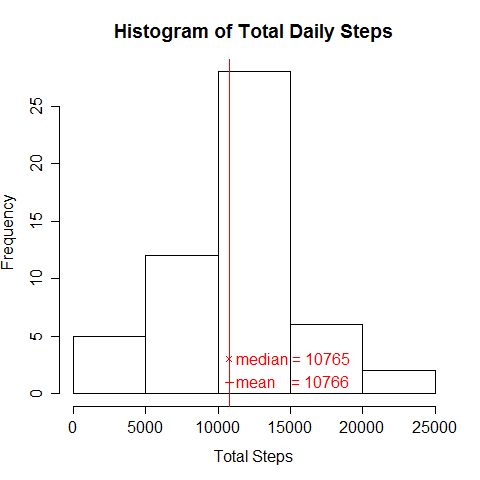
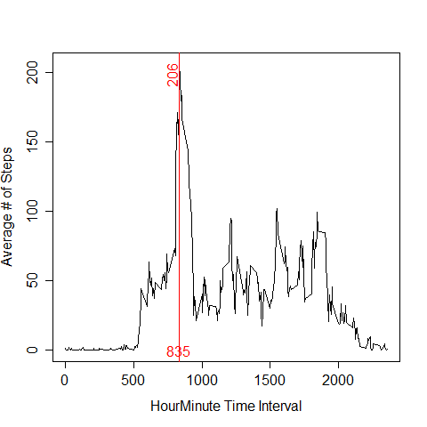
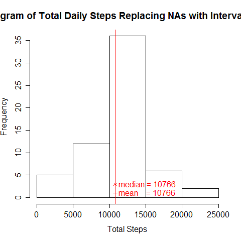
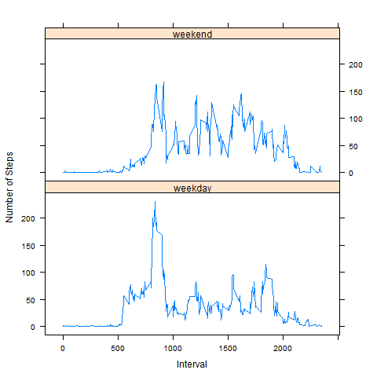

---
#"Reproducible Research: Peer Assessment 1"
This assignment makes use of data from a personal activity monitoring device. This device collects data at 5 minute intervals through out the day. The data consists of two months of data from an anonymous individual collected during the months of October and November, 2012 and include the number of steps taken in 5 minute intervals each day.

The assignment has 5 basic tasks presented as follows:

- Loading and preprocessing the data
- What is mean total number of steps taken per day?
- What is the average daily activity pattern?
- Imputing missing values
- Are there differences in activity patterns between weekdays and weekends?

These tasks are addressed below.

## Loading and preprocessing the data
Check and set up the working directory and figure directory.

```{r}
if (!file.exists("./ReproducibleResearchAssignment1"))
{
        dir.create("./ReproducibleResearchAssignment1")
}
if (!file.exists("./ReproducibleResearchAssignment1/figure"))
{
        dir.create("./ReproducibleResearchAssignment1/figure")
}
```

Check and set up the raw data directory. Download the data.
```{r}
if (!file.exists("./data"))
{
        dir.create("./data")
}
if (!file.exists("./data/RRAssignment1activity.zip"))
{
        fileURL <- "https://d396qusza40orc.cloudfront.net/repdata%2Fdata%2Factivity.zip"
        download.file(fileURL,"./data/RRAssignment1activity.zip", mode = "wb")
```
Save download date
```{r}
        dateDownloaded <- date()
        sink("./ReproducibleResearchAssignment1/dateDataDownloaded.txt")
        cat("Date data downloaded: ")
        cat(dateDownloaded)
        sink()
}
```
Read in the activity data.

```{r}
activity <- read.csv(unz("./data/RRAssignment1activity.zip","activity.csv"))
```

Set the working directory
```{r}
setwd("./ReproducibleResearchAssignment1")
```
 
## What is mean total number of steps taken per day?
Aggregate the data for sums per day and draw the histogram for the total steps. The mean and median is added to the histogram. 

```{r}
sumA <- aggregate(steps ~ date ,data = activity, sum)
meanA <- mean(sumA$steps)
medianA <- median(sumA$steps)
hist(sumA$steps, main="Histogram of Total Daily Steps", xlab = "Total Steps")
abline(v = meanA, col = "red")
points(meanA, 1, col = "red", pch = 3)
meantext <- paste('mean    =', as.character(trunc(meanA)))
text(meanA,1, meantext, pos = 4, col = "red")
points(medianA, 3, col = "red", pch = 4)
mediantext <- paste('median =', as.character(trunc(medianA)))
text(medianA,3, mediantext, pos = 4, col = "red")
dev.copy(png, file= "./figure/histogramTotalStepsIgnoredNAs.png")
dev.off()

```
The mean and median are calculated.
```{r}
meanA <- mean(sumA$steps)
medianA <- median(sumA$steps)
```
They are: mean: 10766.19 and median: 10765

 

## What is the average daily activity pattern?
The code for the time series plot is below. The steps are aggregated intervals. The plot includes a line at the maximum interval. 

The interval is 835 with a value of 206 steps.

```{r}
aveI <- aggregate(steps ~ interval ,data = activity, mean)
maxI <- aveI$interval[which.max(aveI$steps)]
plot(aveI$interval,aveI$steps, type = "l", xlab = "HourMinute Time Interval", ylab = "Average # of Steps")
abline(v = maxI, col = "red")
text(maxI, 0, as.character(maxI), col = "red")
rowNum <- 12*trunc(maxI/100) + (maxI %% 100)/5 + 1
text(maxI, aveI$steps[rowNum], as.character(trunc(aveI$step[rowNum])), pos = 2, col = "red", srt = 90)
dev.copy(png, file= "./figure/averageStepsPerInterval.png")
dev.off()
```



## Imputing missing values
Calculate the number of missing values by subtracting the number of complete cases from the total number of step entries. 
```{r}
naT <- length(activity$steps) - sum(complete.cases(activity$steps))
```
There were 2304 missing step counts.

The strategy used to fill in the missing data was to use the means of each interval.

```{r}
aveS <- aveI$steps
actS <- activity
```

The new dataset was created by replacing the NA steps with the average values as shown in the code below.

```{r}
actS$steps[is.na(actS$steps)] <- aveS
```

Using the new dataset, the plots were created as before with mean and median calculated and shown on the histogram.

```{r}
sumC <- aggregate(steps ~ date ,data = actS, sum)
meanC <- mean(sumC$steps)
medianC <- median(sumC$steps)
hist(sumC$steps, main="Histogram of Total Daily Steps Replacing NAs with Interval Means", xlab = "Total Steps")
abline(v = meanC, col = "red")
points(meanC, 1, col = "red", pch = 3)
meantext <- paste('mean    =', as.character(trunc(meanC)))
text(meanC,1, meantext, pos = 4, col = "red")
points(medianC, 3, col = "red", pch = 4)
mediantext <- paste('median =', as.character(trunc(medianC)))
text(medianC,3, mediantext, pos = 4, col = "red")
dev.copy(png, file= "./figure/histogramTotalStepsFilledNAs.png")
dev.off()
```




They are virtually the same as the values with the NAs ignored. 
They are: mean: 10766.19 and median: 10766.19. I tested other missing value replacements and got differences. It was using this choice that kept them close. They was no impact when using these replacement choices.

## Are there differences in activity patterns between weekdays and weekends?
Creating a data frame for weekdays and weekends involves conversion and day selection.

```{r}
dateAsDate <- as.Date(activity$date, format = "%Y-%m-%d")
daylist <- weekdays(dateAsDate,abbreviate = TRUE)
daylist[daylist %in% c("Sat","Sun")] <- "weekend"
daylist[daylist != "weekend"] <- "weekday"
activeWeek <- cbind(actS,daylist)
```
Creating the average steps in a aggregation.
```{r}
stepsAveInt <- aggregate(activeWeek, by=list(activeWeek$interval,activeWeek$daylist),FUN="mean")
```
The panel plot used the lattice package.
```{r}
stepsAveInt <- aggregate(activeWeek, by=list(activeWeek$interval,activeWeek$daylist),FUN="mean")
names(stepsAveInt)[1] <- "Interval"
names(stepsAveInt)[2] <- "dayType"
xyplot(steps ~ interval | dayType, data = stepsAveInt, layout = c(1,2), type = "l", xlab = "Interval", ylab = "Number of Steps")
dev.copy(png, file= "./figure/AverageStepsbyDayType.png")
dev.off()
```


